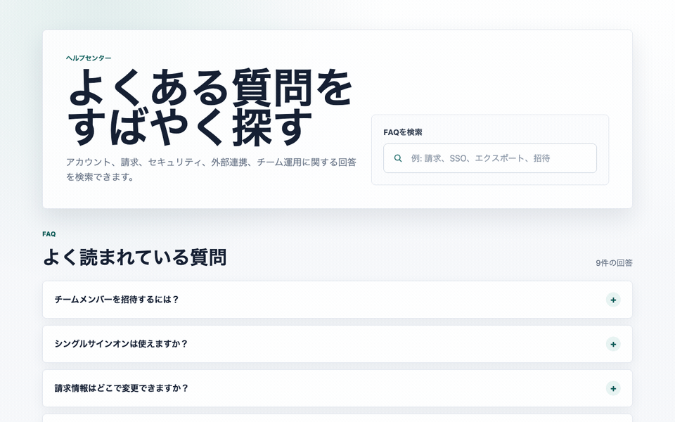
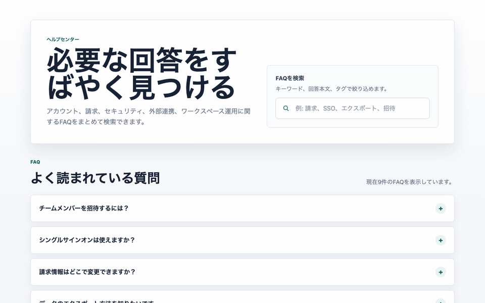

# 雑なFAQ検索アプリを監査して分かった、AI Task Packetに「アクセシビリティ契約」を入れるべき理由

> 2026-06-27 / Codex Mastery Lab 日次ドラフト  
> 想定読了時間: 約10分  
> 種別: Experiment / Failure / Template


## 操作キャプチャ

バイブコーディング版を実際にブラウザで操作したGIF。



指示を見直した版を実際にブラウザで操作したGIF。



## 前回の振り返り

第1回では、この連載の目的を整理した。AIに「いい感じに作って」と頼むだけでは、見た目は速く作れても、後から確認・修正・運用するための情報が足りなくなる。そこで、AIに渡す共通説明書として AIDD-Spec を育てていく方針を決めた。

今回からは実際に小さなアプリを作り、雑な指示で何が抜けるのかを確認する。最初の題材はFAQ検索アプリである。

## 今回やること

Codexに日本語で雑にFAQ検索アプリを作らせる。その後、ブラウザで操作してGIFに残し、アクセシビリティと検索体験を監査する。見つかった欠陥から、最初にAIへ渡すべき Accessibility Contract を逆算する。

## 1. 今日の問い

AI駆動開発では、Codexに「FAQ検索アプリをいい感じに作って」と頼むだけでも、それっぽいUIはかなり速く出てくる。では、その成果物は本当に後工程で読める共通説明書になっているのか。

今日の問いはこれだ。

> 小さなFAQ検索UIをあえて雑なプロンプトで作らせ、アクセシビリティ監査で見つかった欠陥から、AI Task Packetに事前に含めるべき項目を逆算できるか？

料理でいえば、完成写真だけを見て「おいしそう」と判断するのではなく、レシピとして他の人が再現できるかを見る。Webアプリでも同じで、画面がきれいでも、支援技術・キーボード操作・テスト・レビューが読めなければ、標準共通説明書とは言えない。

## 2. 仮説

今回の仮説は次の通り。

> Codexへ雑に「FAQ検索アプリを作って」と渡すと、見た目と基本動作は作る。しかし、検索欄と結果リストのプログラム上の関係、no results状態、キーボード操作、検証証拠は抜けやすい。これらは後から直すのではなく、AI Task Packetの Accessibility Contract と Verification Evidence に最初から入れるべきである。

AIDD-Specの思想は「上流工程の理想論」から標準を作らないことだ。まず後工程で壊れ方を見る。壊れた箇所から、理想状態、修正指示、必要だった前工程情報を逆算する。

## 3. 実験環境

実行環境は以下。M4 Mac mini / 16GB RAM / 256GB SSD という制約環境で、重い依存インストールは避けた。

```text
2026-06-27 12:16:29 JST
ProductName:    macOS
ProductVersion: 26.5.1
BuildVersion:   25F80
arch:           arm64
Disk:           228Gi total / 140Gi available
Codex CLI:      codex-cli 0.142.3
```

実験ディレクトリ:

```text
/Users/tto/codex-mastery-lab/experiments/2026-06-27-accessibility-contract-vibe-faq/
```

ログ:

```text
/Users/tto/codex-mastery-lab/experiments/2026-06-27-accessibility-contract-vibe-faq/logs/
```

## 4. 実験計画

最初に `PLAN.md` を作り、今回の監査カテゴリを3つに絞った。

1. Accessibility
2. Requirement Fit / State Behavior
3. Build / Console / Verification Evidence

今回はLighthouseやaxeを入れない。理由は、今日の目的が「重い監査ツールを回すこと」ではなく、雑プロンプトで抜けた項目をAI Task Packetへ戻すことだからだ。依存なしの静的監査でも、前工程に戻すべき欠陥は十分に見える。

## 5. 実際にCodexへ渡した雑プロンプト

Codexには以下をそのまま渡した。

```text
このgitリポジトリ内で、`experiments/2026-06-27-accessibility-contract-vibe-faq/vibe-app` に小さな静的FAQ検索アプリを作ってください。
HTML、CSS、素のJavaScriptだけを使ってください。日本語のSaaSヘルプセンターらしく、見た目も整えてください。
FAQは8件以上用意し、検索欄に入力すると質問・回答・タグをリアルタイムに絞り込めるようにしてください。
シンプルにしてください。依存パッケージはインストールしないでください。`vibe-app` ディレクトリの外は変更しないでください。完了したら終了してください。
```

実行コマンド:

```bash
codex exec --sandbox danger-full-access "このgitリポジトリ内で、experiments/2026-06-27-accessibility-contract-vibe-faq/vibe-app に小さな静的FAQ検索アプリを作ってください。HTML、CSS、素のJavaScriptだけを使ってください。日本語のSaaSヘルプセンターらしく、見た目も整えてください。FAQは8件以上用意し、検索欄に入力すると質問・回答・タグをリアルタイムに絞り込めるようにしてください。シンプルにしてください。依存パッケージはインストールしないでください。vibe-app ディレクトリの外は変更しないでください。完了したら終了してください。"
```

Codexは `vibe-app` に3ファイルを作った。

```text
index.html  45 lines
styles.css  248 lines
app.js      89 lines
```

Codexの最終報告はこうだった。

```text
指定ディレクトリに静的FAQ検索アプリを作成しました:
experiments/2026-06-27-accessibility-contract-vibe-faq/vibe-app/index.html

HTML、CSS、素のJavaScriptのみで構成し、FAQ 9件とリアルタイム検索を含めています。
依存パッケージはインストールしていません。変更は指定された `vibe-app` ディレクトリ内だけです。
```

ここまでは良い。依存なし、指定ディレクトリ内、FAQ 9件、ライブ検索あり。雑プロンプトとしてはかなり優秀だ。

## 6. 生成されたコードの良かった点

まず、Codexを公平に評価すると、vibe-appには良い点も多かった。

```html
<form class="search-panel" role="search">
  <label for="faq-search">FAQを検索</label>
  <div class="search-box">
    <svg aria-hidden="true" viewBox="0 0 24 24" focusable="false">
      ...
    </svg>
    <input id="faq-search" type="search" autocomplete="off" placeholder="例: 請求、SSO、エクスポート、招待">
  </div>
</form>
```

- `label for="faq-search"` がある
- SVGは `aria-hidden="true"` / `focusable="false"`
- `role="search"` がある
- `aria-live="polite"` の結果件数表示がある
- FAQは `details` / `summary` を使っており、標準HTMLの開閉UIに寄せている

つまり、「AIはアクセシビリティを完全に無視する」という話ではない。むしろ、明示していない割にはかなり良い。しかし、後工程で監査すると「標準仕様としては足りない」部分が出る。

## 7. 静的監査を実行した

まずJavaScriptの構文チェック。

```bash
node --check experiments/2026-06-27-accessibility-contract-vibe-faq/vibe-app/app.js
```

これは通った。次に、HTML/CSS/JSを軽く静的監査した。チェックしたのは、検索欄ラベル、結果件数live region、リストセマンティクス、`aria-controls`、`aria-describedby`、フォームsubmit抑止、`:focus-visible` などだ。

結果:

```text
合格: html要素にlang属性がある
合格: 検索欄に見えるラベルがある
合格: 結果件数がaria-liveで通知される
不合格: FAQ一覧がul/liのリスト構造になっている
不合格: 検索欄がfaq-listを制御対象として宣言している
不合格: 検索欄が該当なし表示を参照している
不合格: フォーム送信時のページ再読み込みを防いでいる
不合格: キーボードフォーカス用の:focus-visible指定がある
合格: FAQデータが8件以上ある
合格: 依存パッケージのimport/requireを使っていない
```

HTTP serverでも配信確認だけ行った。

```bash
python3 -m http.server 8765 --directory experiments/2026-06-27-accessibility-contract-vibe-faq/vibe-app
curl -s http://127.0.0.1:8765/ -o experiments/2026-06-27-accessibility-contract-vibe-faq/logs/http-index.html
```

確認結果:

```text
bytes 1850
has title True
```

ここで大事なのは、「画面が表示される」ことと「後工程が監査できる」ことは別だという点だ。

## 8. 欠陥1: FAQ一覧がdivで、コレクションとして読めない

vibe-appのHTMLはこうだった。

```html
<div id="faq-list" class="faq-list"></div>
```

JS側で `details` を追加しているが、FAQ全体は `ul/li` ではない。人間の目にはカード一覧に見える。しかし、支援技術や静的監査にとっては「FAQ項目のコレクション」であることが曖昧になる。

ここは駆け出しエンジニアほど見落としやすい。`div` は意味を持たない汎用の箱なので、見た目をカード状に並べることはできても、「これは同じ種類の項目が並んだ一覧です」という意味までは伝えない。一方で `ul` は unordered list、つまり順序に意味がない一覧を表すHTML要素で、`li` はその一覧の1項目を表す。FAQは「質問と回答が複数並ぶ一覧」なので、まず `ul/li` が自然な表現になる。

これはアクセシビリティだけの話ではない。レビューする人間にとっても、テストを書く人にとっても、将来CSSやJSを直す人にとっても、`ul#faq-list > li` の構造になっている方が「ここはFAQ一覧だ」とすぐ読める。HTMLの意味づけが正しいと、後工程の監査・E2Eテスト・スクリーンリーダー確認・保守が全部やりやすくなる。逆に `div` だけで作ると、見た目は同じでも、コードを読んだ人が毎回「これは本当に一覧なのか？」を推測する必要が出る。

もちろん、必ず `ul/li` しか使ってはいけないわけではない。複雑な仮想リストや独自コンポーネントでは `role="list"` / `role="listitem"` を使う選択もある。ただし、今回のような普通のFAQ一覧なら、まずは標準HTMLの `ul/li` を使うのが一番説明しやすく、壊れにくい。

理想状態:

```html
<ul id="faq-list" class="faq-list"></ul>
```

各項目は `li` として追加する。カスタム要素を使うなら、少なくとも `role="list"` / `role="listitem"` が必要になる。

逆算すると、これは実装後に「ulに直して」ではなく、AI Task Packetの `accessibility_contract.collection_semantics` に入れるべき項目だ。

## 9. 欠陥2: 検索欄と結果領域の関係がプログラム上つながっていない

vibe-appの検索欄はラベル付きで悪くない。しかし、検索欄がどの領域を制御しているのかは明示されていない。

不足していたもの:

```html
aria-controls="faq-list"
aria-describedby="search-help result-status no-results"
```

人間には「この検索欄はFAQを絞り込む」と分かる。しかし、AIが作るUI標準としては、視覚的配置だけに頼ってはいけない。検索欄、ヘルプテキスト、結果件数、no results状態が、DOM上でも関係として読める必要がある。

これは料理でいえば、材料名はあるのに分量や手順が書かれていない状態に近い。

## 10. 欠陥3: Enterキーの挙動が仕様化されていない

vibe-appにはフォームがあるが、submitイベントを抑止していなかった。

```js
searchInput.addEventListener("input", filterFaqs);
```

ライブ検索では、Enterキーでページがリロードされると、キーボードユーザーの文脈が壊れる可能性がある。静的HTMLではブラウザ既定動作によりGET送信・再読み込みに近い挙動になることがある。

理想状態:

```js
form.addEventListener("submit", (event) => {
  event.preventDefault();
});
```

この欠陥は、AIが賢いかどうかではなく、前工程で「Enterキーの期待挙動」を渡していないことが原因だ。AI Task Packetには `keyboard_interactions` が必要になる。

## 11. 欠陥4: 検証証拠が成果物として残らない

vibe promptでは、Codexに「作って」とは言ったが、「何を実行して合格とするか」を渡していない。

結果として、Codexはファイル作成とgit status確認はしたが、アクセシビリティ契約を検証するコマンドは残さなかった。

AIDD-Specでは、これは `Verification Evidence` の欠落である。

理想状態:

```yaml
quality_gate:
  required_commands:
    - node --check path/to/app.js
    - python3 path/to/audit_static.py path/to/app
```

小さなUIでも、最低限「何をもって完了とするか」を実行可能な形にする必要がある。


## 12. 逆算してAI Task Packet v0.1を作った

監査結果から、次のAI Task Packetを作った。

```text
# AI Task Packet v0.1: アクセシブルなFAQ検索

## 機能要件

- FAQは8件以上用意する。
- 検索欄は、質問・回答・タグを対象にリアルタイムで絞り込む。
- 検索欄が空のときは全FAQを表示する。
- 該当なしの場合は、見える形で「一致するFAQがない」状態を表示する。
- 検索フォーム内でEnterキーを押しても、ページを再読み込みしない。

## アクセシビリティ契約

- 検索欄には見えるラベルを付ける。
- 検索欄には `aria-controls="faq-list"` を指定し、制御対象の結果一覧を明示する。
- 検索欄には `aria-describedby` を指定し、補足説明・結果件数・該当なし表示を参照させる。
- 結果件数は `aria-live="polite"` の領域に置き、検索中は検索語との関係も伝わる文にする。
- FAQ一覧は `ul/li`、または同等の `role="list"/"listitem"` でリスト構造として表す。
- FAQの開閉コントロールはキーボード操作でき、フォーカス位置が見えるようにする。
- CSSにはキーボードフォーカス確認用の `:focus-visible` を入れる。
- 装飾アイコンは `aria-hidden="true"` かつ `focusable="false"` にする。

## 品質ゲート / 検証証拠

実行コマンド:
- node --check experiments/2026-06-27-accessibility-contract-vibe-faq/fixed-app/app.js
- python3 experiments/2026-06-27-accessibility-contract-vibe-faq/audit_static.py experiments/2026-06-27-accessibility-contract-vibe-faq/fixed-app
```

これをCodexに渡して、`fixed-app` を作らせた。

実行コマンド:

```bash
codex exec --sandbox danger-full-access "experiments/2026-06-27-accessibility-contract-vibe-faq/AI_TASK_PACKET_v0.1.md を読んで、その内容どおりに実装してください。変更は experiments/2026-06-27-accessibility-contract-vibe-faq/fixed-app 内に閉じ込めてください。ただし、必要であれば実験ディレクトリ直下に audit_static.py を置いてかまいません。依存パッケージはインストールしないでください。可能であれば検証コマンドを実行し、結果を報告してください。"
```

## 13. 修正後の結果

Codexは `fixed-app` と `audit_static.py` を作り、検証まで実行した。

こちらでも再実行した結果:

```text
## 修正版 node 構文チェック
合格: app.js の構文エラーなし

## 修正版 静的監査
合格: html要素にlang属性がある
合格: 検索欄に見えるラベルがある
合格: 検索欄がfaq-listを制御対象として宣言している
合格: 検索欄が補足説明テキストを参照している
合格: 検索欄が結果件数表示を参照している
合格: 検索欄が該当なし表示を参照している
合格: 結果件数がaria-liveで通知される
合格: FAQ一覧がul/liのリスト構造になっている
合格: FAQデータが8件以上ある
合格: FAQ開閉にbutton要素を使っている
合格: フォーム送信時のページ再読み込みを防いでいる
合格: キーボードフォーカス用の:focus-visible指定がある
合格: 装飾SVGがaria-hiddenかつfocusable=falseになっている
合格: 依存パッケージのimport/requireを使っていない
```

差分として重要なのは、単にHTMLが変わったことではない。Codexに渡した前工程情報が変わると、成果物の構造が変わったことだ。

fixed-appでは検索欄がこうなった。

```html
<input
  id="faq-search"
  type="search"
  autocomplete="off"
  placeholder="例: 請求、SSO、エクスポート、招待"
  aria-controls="faq-list"
  aria-describedby="search-help result-status no-results"
>
```

FAQ一覧もこうなった。

```html
<ul id="faq-list" class="faq-list"></ul>
```

そしてJSにsubmit抑止が入った。

```js
form.addEventListener("submit", (event) => {
  event.preventDefault();
});
```

## 14. 標準フォーマットでの監査結果

今回の代表的なfindingをAIDD-Specの標準形式で記録すると、こうなる。

```yaml
category: アクセシビリティ
finding: 検索欄が、どの結果領域を制御し、どの状態テキストに説明されるのかを宣言していなかった。
severity: high
observed_by: 静的HTML監査
ideal_state: 検索欄が、結果一覧、補足説明、結果件数、該当なし状態とプログラム上もつながっている。
fix_instruction: inputに aria-controls="faq-list" と aria-describedby="search-help result-status no-results" を追加し、参照先要素をDOM内に常に存在させる。
needed_upstream_info:
  - アクセシビリティ契約
  - 状態設計: empty/loading/error/success
  - 画面文言契約
standard_update:
  document: AI Task Packet
  field: accessibility_contract.search_relationships
codex_prompt_delta: |
  検索欄には、結果一覧を指すaria-controlsと、補足説明・結果件数・該当なし表示を指すaria-describedbyを必ず指定する。
verification:
  command: python3 experiments/2026-06-27-accessibility-contract-vibe-faq/audit_static.py experiments/2026-06-27-accessibility-contract-vibe-faq/fixed-app
  expected: 合格
```

この形式にすることで、欠陥が単なる反省で終わらず、次回の前工程成果物に戻る。

## 15. AIDD-Specへの反映

今日の結果を受けて、標準仕様として以下を追加した。

```text
/Users/tto/codex-mastery-lab/standards/aidd-spec-ai-task-packet-standard-v0.1.md
```

追加した主なフィールド:

```yaml
accessibility_contract:
  relationships: []
  collection_semantics: []
  keyboard_interactions: []
  focus_evidence: []
quality_gate:
  required_commands: []
verification_evidence:
  files_to_attach: []
  logs_to_save: []
```

ここでのポイントは、Accessibility Contractを「善意のチェックリスト」にしないことだ。Codexに渡せる実装条件、監査できるDOM条件、再実行できるコマンドに落とす。

## 16. CTO視点の考察

今回の実験で最も重要だったのは、Codexが失敗したことではない。むしろCodexは、雑な指示に対してかなり良いものを出した。

問題は、雑な指示でも「それっぽく良いもの」が出てしまうことだ。

これはAI駆動開発の危険なところで、成果物の表面品質が高いほど、後工程の欠陥が見えにくくなる。だから、AI時代の共通説明書には次が必要になる。

- UI部品の見た目だけでなく、支援技術との関係を書く
- 画面状態だけでなく、状態遷移時に読み上げるテキストを書く
- キーボード操作の期待挙動を書く
- 完了条件を「見た目」ではなく「コマンドで再現できる証拠」にする

料理でいうなら、完成写真だけを渡すのではなく、材料表、手順、火加減、確認チェックリストまで渡す。そのソフトウェア版がAIDD-Specであり、Codexへ渡す最小実装単位がAI Task Packetだ。

## 17. SaaS化するなら何を作るか

AIDD Control PlaneとしてSaaS化するなら、今回の学びはそのまま機能になる。

1. UI種別として「検索UI」を選ぶ
2. SaaSが必須のAccessibility Contractを提示する
3. `aria-controls` / `aria-describedby` / live region / list semantics をフォームで入力させる
4. その入力からAI Task Packetを生成する
5. Codex実行後、静的監査を自動実行する
6. FAILした項目から修正プロンプトと標準仕様更新案を生成する

価値は「AIにコードを書かせる」ことではない。AIが作ったものを検査可能な共通説明書レベルへ引き上げ、次回から最初に渡す仕様を改善することだ。

## 18. 明日から使えるチェックリスト

検索UIをAIに作らせる前に、最低限これをAI Task Packetへ入れる。

- [ ] 検索欄にvisible labelがあるか
- [ ] 検索欄が `aria-controls` で結果領域を指しているか
- [ ] 検索欄が `aria-describedby` でヘルプ、結果件数、no resultsを参照しているか
- [ ] 結果件数が `aria-live="polite"` で更新されるか
- [ ] 結果一覧が `ul/li` または equivalent role で表現されるか
- [ ] no results状態の表示文言が決まっているか
- [ ] Enterキーでページ遷移・reloadしないか
- [ ] キーボードフォーカスが `:focus-visible` で見えるか
- [ ] `node --check` など最低限の検証コマンドがあるか
- [ ] 監査結果をログとして保存するか

## 19. 次回検証

次回は、同じFAQ検索アプリに対して、静的監査ではなくaxe / Lighthouse / Playwrightの軽量監査をどこまでM4 Mac miniで現実的に回せるかを調べたい。

今日の結論は明確だ。

> Codexのアウトプット品質を上げる最短距離は、プロンプトを長くすることではない。後工程の監査で必要になる情報を、AI Task Packetの標準フィールドとして前工程に戻すことである。

今日の小さなFAQアプリは、その最小の証拠になった。
