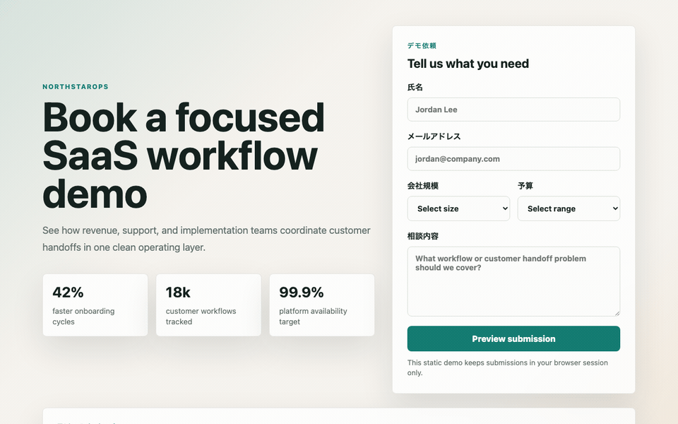
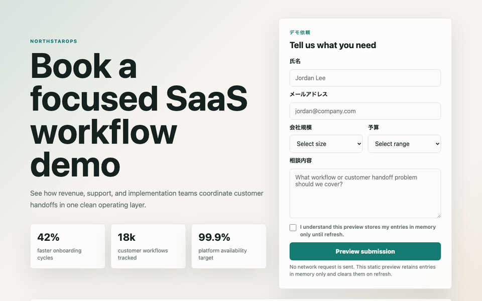

# 問い合わせフォームのPIIを、Security BaselineからAI Task Packetへ逆算する

> 2026-06-27 / Codex Mastery Lab 日次ドラフト  
> 想定読了時間: 約10分  
> 種別: Experiment / Failure / Template


## 操作キャプチャ

バイブコーディング版を実際にブラウザで操作したGIF。



指示を見直した版を実際にブラウザで操作したGIF。



## 前回の振り返り

前回はSaaSギャラリーを題材に、見た目を良くする指示だけでは Performance Budget や Asset Policy が成果物に残りにくいことを確認した。動いているかどうかだけでなく、後から性能を確認できる証拠が必要だと分かった。

今回のテーマは問い合わせフォームである。フォームは見た目が整っていると安心しがちだが、名前、メール、予算、相談内容などを扱う以上、個人情報や営業情報をどう扱うかを最初に決める必要がある。

## 今回やること

Codexに日本語で問い合わせフォームを作らせる。バイブ版と修正版をブラウザで操作してGIFで比較し、PII分類、同意、保存方針、ログ方針を Security / Privacy Baseline としてAI Task Packetへ戻す。

## 1. 今日の問い

前回までに、FAQ検索UIではアクセシビリティ契約、SaaSギャラリーではPerformance BudgetをAI Task Packetへ戻した。今日の問いは、フォームである。

> Codexに「B2B SaaSの問い合わせフォームをいい感じに作って」と雑に頼んだとき、後工程のSecurity / Privacy監査が読むべきPII分類、入力制約、保存方針、同意、証拠ファイルは成果物に残るのか？

旅行でいえば、目的地だけ決めても足りない。持ち物、予算、移動手段、緊急連絡先、キャンセル条件まで決めておく必要がある。ソフトウェアの問い合わせフォームも同じで、UIとして成立していても、PIIをどう扱うかが説明書に書かれていなければ、後工程のセキュリティ担当・法務・運用担当は読めない。

## 2. 仮説

今回の仮説は次の通り。

> フォームUIは、見た目と基本動作が成立しやすい。そのため「動いたからOK」になりやすい。しかし、後工程が必要とする Data Classification、consent、retention、no-network/no-storage、safe rendering の証拠は、雑プロンプトでは抜けやすい。これは後からレビューで怒るのではなく、AI Task Packetの Security Contract / Privacy Contract / Verification Evidence に最初から入れるべきである。

今回は重い依存は入れない。M4 Mac mini / 16GB RAM / 256GB SSD の制約環境で回す日次実験なので、ブラウザ自動化や脆弱性スキャナではなく、HTML/CSS/JSの静的監査で「前工程に戻すべき情報」を抽出する。

## 3. 実験環境

```text
Sat Jun 27 12:49:17 JST 2026
Codex CLI: codex-cli 0.142.3
ProductName:    macOS
ProductVersion: 26.5.1
BuildVersion:   25F80
Disk:           228Gi total / 140Gi available
```

実験ディレクトリ:

```text
/Users/tto/codex-mastery-lab/experiments/2026-06-27-security-baseline-contact-form/
```

ログ:

```text
/Users/tto/codex-mastery-lab/experiments/2026-06-27-security-baseline-contact-form/logs/
```

## 4. 実験計画

`PLAN.md` では、監査カテゴリを次の3つに絞った。

1. Security / Vulnerability
2. Privacy / Data Classification
3. Build / Console / Verification Evidence

今回の目的は、問い合わせフォームそのものを本番品質にすることではない。目的は、後工程の監査が「これが分からないと合格にできない」と判断する情報を見つけ、それをAI Task Packetの標準フィールドへ戻すことである。

## 5. Codexへ渡した雑プロンプト

実際にCodexへ渡したプロンプトはこれである。

```text
このgitリポジトリ内で、`experiments/2026-06-27-security-baseline-contact-form/vibe-app` に小さな静的SaaS問い合わせフォームを作ってください。HTML、CSS、素のJavaScriptだけを使ってください。日本語のB2B SaaSデモ依頼ページとして見た目を整えてください。氏名、メールアドレス、会社規模、予算、相談内容の項目を入れてください。入力内容を送信前に確認できるプレビュー欄も作ってください。シンプルにしてください。依存パッケージはインストールしないでください。`vibe-app` ディレクトリの外は変更しないでください。 Then exit.
```

実行コマンド:

```bash
codex exec --sandbox danger-full-access "このgitリポジトリ内で、`experiments/2026-06-27-security-baseline-contact-form/vibe-app` に小さな静的SaaS問い合わせフォームを作ってください。HTML、CSS、素のJavaScriptだけを使ってください。日本語のB2B SaaSデモ依頼ページとして見た目を整えてください。氏名、メールアドレス、会社規模、予算、相談内容の項目を入れてください。入力内容を送信前に確認できるプレビュー欄も作ってください。シンプルにしてください。依存パッケージはインストールしないでください。`vibe-app` ディレクトリの外は変更しないでください。 Then exit."
```

Codexは `vibe-app` に3ファイルを作った。

```text
index.html
styles.css
app.js
```

Codexの最終報告はこうだった。

```text
氏名、メールアドレス、会社規模、予算、相談内容、入力プレビュー欄を含めました。依存パッケージはインストールしておらず、`vibe-app` の外は変更していません。
Verification run: `node --check experiments/2026-06-27-security-baseline-contact-form/vibe-app/app.js` passed.
```

ここまでは優秀である。依存なし、指定ディレクトリ内、JavaScript構文チェックも通っている。さらに重要なのは、Codexがユーザー入力の表示に `textContent` を使っていたことだ。

```js
const message = document.createElement("p");
message.className = "submission-message";
message.textContent = submission.message;
```

つまり、雑プロンプトでもXSSの典型的な失敗である `innerHTML` は避けていた。今回の論点は「Codexが危険なコードを書いた」ではない。むしろ逆で、良い判断をしているのに、標準仕様として後工程が読むべき証拠が残っていないことが問題である。

## 6. 静的セキュリティ監査を作った

監査スクリプト `audit_static_security.py` は、次を確認する。

- 必須ファイルの存在
- フォームの安定ID
- `type="email"` と `required`
- free-text入力の `maxlength`
- company size / budget がselectで制約されているか
- privacy consent checkboxがrequiredか
- PII / business sensitive fieldに `data-classification` があるか
- privacy / retention helper textがあるか
- no-networkの明示があるか
- `innerHTML` / `insertAdjacentHTML` / `outerHTML` を使っていないか
- `textContent` で表示しているか
- `fetch` / `XMLHttpRequest` / `sendBeacon` を使っていないか
- `localStorage` / `sessionStorage` / `indexedDB` を使っていないか
- `console.log` にPIIを出していないか
- `SECURITY_PRIVACY.md` があるか

実行コマンド:

```bash
node --check experiments/2026-06-27-security-baseline-contact-form/vibe-app/app.js
python3 experiments/2026-06-27-security-baseline-contact-form/audit_static_security.py experiments/2026-06-27-security-baseline-contact-form/vibe-app
```

結果:

```text
APP: experiments/2026-06-27-security-baseline-contact-form/vibe-app
SIZES: total_static_bytes=10538 html=3471 css=4889 js=2178
合格: 必要ファイル index.html / styles.css / app.js が存在する
合格: 問い合わせフォームに安定したidがある
合格: メール欄が type=email になっている
合格: 必須項目がrequiredで宣言されている
不合格: テキスト入力/textareaにmaxlength制約がある
合格: 会社規模がselectで制約されている
合格: 予算がselectで制約されている
不合格: プライバシー同意チェックが必須になっている
不合格: PII/業務情報フィールドにdata-classificationがある
不合格: フォーム項目がプライバシー/保持期間の説明を参照している
不合格: 静的デモ/no-network方針がフォームに明示されている
合格: ユーザー入力値をHTML注入APIで描画していない
合格: ユーザー入力プレビューをtextContent等の安全なAPIで描画している
合格: 静的デモ内でネットワーク送信APIを使っていない
合格: PIIをブラウザストレージに保存していない
合格: フォーム/PIIデータをconsoleに出していない
不合格: SECURITY_PRIVACY.md 証跡ファイルが存在する
不合格: 証跡ファイルが分類、PII、保持、no-network、検証を含む
SUMMARY: 11 passed / 7 failed
```

ここで見るべきは、失敗と成功の両方である。

成功している点:

- `textContent` で表示しており、HTML injection APIを避けている
- network submission APIを使っていない
- browser persistent storageを使っていない
- consoleへPIIを出していない

失敗している点:

- `maxlength` がない
- privacy consentがない
- `data-classification` がない
- no-network / retention方針がDOM上で読めない
- `SECURITY_PRIVACY.md` がない

つまり、実装判断は悪くない。しかし、監査証跡として読めない。これはAI時代の危険な失敗である。「良い実装だったから安全」ではなく、「なぜ安全と言えるのかを後工程が再確認できない」状態だからだ。


## 7. 欠陥から理想状態を定義する

代表findingをAIDD-Spec標準形式で書く。

```yaml
category: プライバシー / データ分類
finding: バイブ版アプリは、氏名・メール・予算・会社規模・自由記述の相談内容を集めていたが、機械的に読めるデータ分類や同意/保持期間の契約がなかった。
severity: high
observed_by: audit_static_security.py
ideal_state: PIIと業務上重要な情報がDOMと証跡ファイルの両方で分類され、ユーザーが保持期間/no-network挙動をプレビュー前に理解できる。
fix_instruction: Add data-classification attributes, privacy/retention helper text, and a required privacy consent checkbox.
needed_upstream_info:
  - Privacy/Data Classification
  - Consent Policy
  - Retention Policy
standard_update:
  document: AI Task Packet Standard
  field: privacy_contract.data_classification + privacy_contract.retention + privacy_contract.consent
codex_prompt_delta: |
  PII/業務情報フィールドにdata-classificationを付ける。この静的デモではデータを画面更新までメモリ上にだけ保持し、プレビュー前にプライバシー同意を必須にすることを説明する。
verification:
  command: python3 experiments/2026-06-27-security-baseline-contact-form/audit_static_security.py experiments/2026-06-27-security-baseline-contact-form/fixed-app
  expected: PASS
```

このfindingから逆算すると、AI Task Packetには少なくとも以下が必要になる。

- `security_contract.safe_rendering`
- `security_contract.input_validation`
- `security_contract.prohibited_browser_apis`
- `security_contract.logging_policy`
- `privacy_contract.pii_fields`
- `privacy_contract.business_sensitive_fields`
- `privacy_contract.consent_required`
- `privacy_contract.retention_policy`
- `privacy_contract.storage_policy`
- `verification_evidence.security_privacy_file`

## 8. 改善版 AI Task Packet v0.3

改善版では、Codexに次の条件を渡した。

```markdown
## Security Contract
- Treat name, email, budget, company size, and message as user-controlled input.
- Render user-controlled values only through safe text APIs such as `textContent`; do not use `innerHTML`, `outerHTML`, or `insertAdjacentHTML` for submitted values.
- Do not use `fetch`, `XMLHttpRequest`, or `navigator.sendBeacon`; this is a static no-network demo.
- Do not use `localStorage`, `sessionStorage`, or `indexedDB`; PII must not be persisted in browser storage.
- Do not log submitted form values to console.
- Add explicit length constraints: name max 80, email max 120, message max 600.

## Privacy / Data Classification Contract
- Add `data-classification` attributes to PII/business-sensitive fields.
- Add visible helper text explaining this is a no-network preview and that data is retained in memory only until refresh.
- Add a required privacy consent checkbox named `privacyConsent` before previewing.
- Add `data-static-demo="true"` to the form.

## Verification Evidence
Create `SECURITY_PRIVACY.md` inside `fixed-app/`.
```

実行コマンド:

```bash
codex exec --sandbox danger-full-access "Read experiments/2026-06-27-security-baseline-contact-form/AI_TASK_PACKET_v0.3.md. Implement exactly that packet. Keep all changes inside experiments/2026-06-27-security-baseline-contact-form/fixed-app. Do not install dependencies. Then run the verification commands if possible and report results. Then exit."
```

## 9. 修正後の結果

Codexは `fixed-app` に以下を作った。

```text
index.html
styles.css
app.js
SECURITY_PRIVACY.md
```

こちらでも検証を再実行した。

```text
APP: experiments/2026-06-27-security-baseline-contact-form/fixed-app
SIZES: total_static_bytes=13061 html=5197 css=5291 js=2573
合格: 必要ファイル index.html / styles.css / app.js が存在する
合格: 問い合わせフォームに安定したidがある
合格: メール欄が type=email になっている
合格: 必須項目がrequiredで宣言されている
合格: テキスト入力/textareaにmaxlength制約がある
合格: 会社規模がselectで制約されている
合格: 予算がselectで制約されている
合格: プライバシー同意チェックが必須になっている
合格: PII/業務情報フィールドにdata-classificationがある
合格: フォーム項目がプライバシー/保持期間の説明を参照している
合格: 静的デモ/no-network方針がフォームに明示されている
合格: ユーザー入力値をHTML注入APIで描画していない
合格: ユーザー入力プレビューをtextContent等の安全なAPIで描画している
合格: 静的デモ内でネットワーク送信APIを使っていない
合格: PIIをブラウザストレージに保存していない
合格: フォーム/PIIデータをconsoleに出していない
合格: SECURITY_PRIVACY.md 証跡ファイルが存在する
合格: 証跡ファイルが分類、PII、保持、no-network、検証を含む
SUMMARY: 18 passed / 0 failed
```

HTTP配信も確認した。

```text
status 200
bytes 5197
content_type text/html
has title True
has static demo marker True
has consent True
```

差分として大きいのは、単にHTML属性が増えたことではない。`SECURITY_PRIVACY.md` が成果物として残ったことである。

```markdown
## Data Classification
| Field | Control | Data classification |
| Name | `name` | `pii.name` |
| Email | `email` | `pii.email` |
| Company size | `companySize` | `business.company_size` |
| Budget | `budget` | `business.budget` |
| Message | `message` | `pii_or_confidential.free_text` |

## No Network and No Storage
The form declares `data-static-demo="true"`. The application does not call `fetch`, `XMLHttpRequest`, or `navigator.sendBeacon`, and it does not use `localStorage`, `sessionStorage`, or `indexedDB`.
```

後工程のレビュー担当は、チャット上の「安全にしました」ではなく、リポジトリに残った証拠を読める。これがVerification Evidenceである。

## 10. AIDD-Specへの反映

今回、標準仕様ファイルを更新した。

```text
/Users/tto/codex-mastery-lab/standards/aidd-spec-ai-task-packet-standard-v0.1.md
```

追加した主なフィールド:

```yaml
security_contract:
  safe_rendering: []
  prohibited_browser_apis: []
  logging_policy: string
privacy_contract:
  pii_fields: []
  business_sensitive_fields: []
  consent_required: boolean
  retention_policy: string
  storage_policy: string
verification_evidence:
  files_to_attach:
    - SECURITY_PRIVACY.md
```

AIDD Control Planeにするなら、これはフォームになる。UI種別で「問い合わせフォーム」を選んだ瞬間に、PII項目、業務機密項目、保存先、保持期間、同意文言、禁止API、証拠ファイルを入力させる。Codex実行後は、`data-classification` と `SECURITY_PRIVACY.md` を自動監査する。

## 11. CTO視点の考察

今回の学びは、セキュリティは「脆弱なコードを探す」だけでは足りないということだ。雑プロンプト版は、危険な `innerHTML` も使っていないし、勝手にネットワーク送信もしていない。表面的にはかなり良い。

しかし、組織で運用するには足りない。なぜなら、PIIの扱いはコードの安全性だけでなく、説明責任だからだ。

- どのフィールドがPIIか
- どのフィールドが業務機密か
- どこに保存するのか
- いつ消えるのか
- ユーザーに何を説明したのか
- 何をもって「送信していない」と確認したのか

これらがないと、後工程はレビューできない。家計簿でいえば、支出額だけ書いてあり、何の支出か、誰が承認したか、いつまで保管するかが分からない状態である。

AI駆動開発では、AIがかなり良い初期実装を出す。だからこそ、表面品質に騙される。AIDD-Specの役割は、AIの善意や偶然の良い判断を、再現可能な共通説明書に変換することだ。

## 12. 明日から使えるチェックリスト

問い合わせフォームをAIに作らせる前に、最低限これをAI Task Packetへ入れる。

- [ ] どのフィールドがPIIかを書く
- [ ] どのフィールドが業務機密かを書く
- [ ] `maxlength` など入力サイズ制約を書く
- [ ] ユーザー入力のDOM表示は `textContent` のみにする
- [ ] `innerHTML` / `outerHTML` / `insertAdjacentHTML` を禁止する
- [ ] 静的デモなら `fetch` / `XMLHttpRequest` / `sendBeacon` を禁止する
- [ ] PIIを `localStorage` / `sessionStorage` / `indexedDB` に保存しない
- [ ] consoleにPIIを出さない
- [ ] retention方針を書く
- [ ] privacy consentが必要かを書く
- [ ] `SECURITY_PRIVACY.md` をVerification Evidenceとして残す

## 13. 次回検証

次は、同じ問い合わせフォームにサーバーAPIを足した場合を検証したい。静的フォームでは no-network / no-storage を禁止すればよかった。しかし、実サービスでは送信先がある。そうなると、CSRF、rate limit、server-side validation、audit log、retention、削除要求、メール通知、権限境界が出てくる。

今日の結論は明確だ。

> フォームのSecurity Baselineは、実装後レビューのチェックリストではなく、AI Task Packetに事前に渡すべき共通説明書である。

Codexがたまたま安全なDOM APIを選んだことを喜ぶだけでは足りない。後工程が読める証拠に変換し、次回から最初に渡す。それがAIDD-Specの逆算プロセスである。
