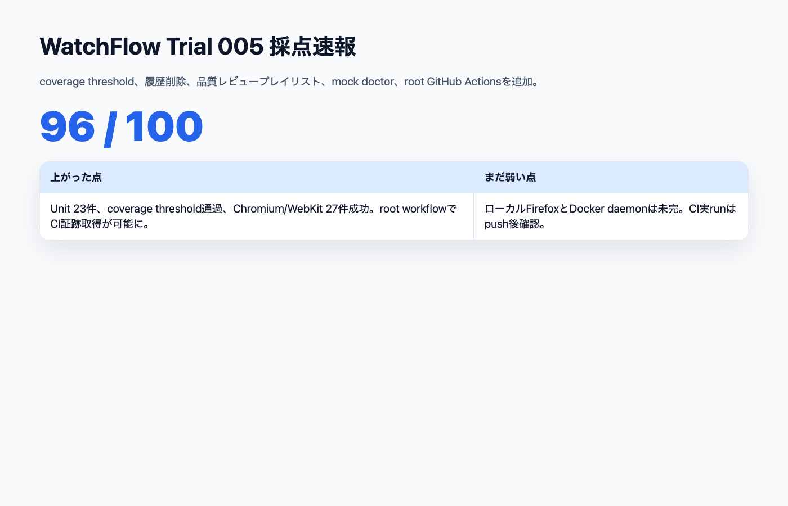
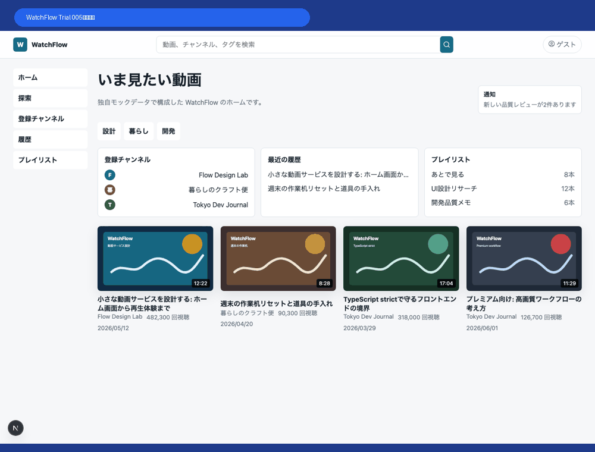
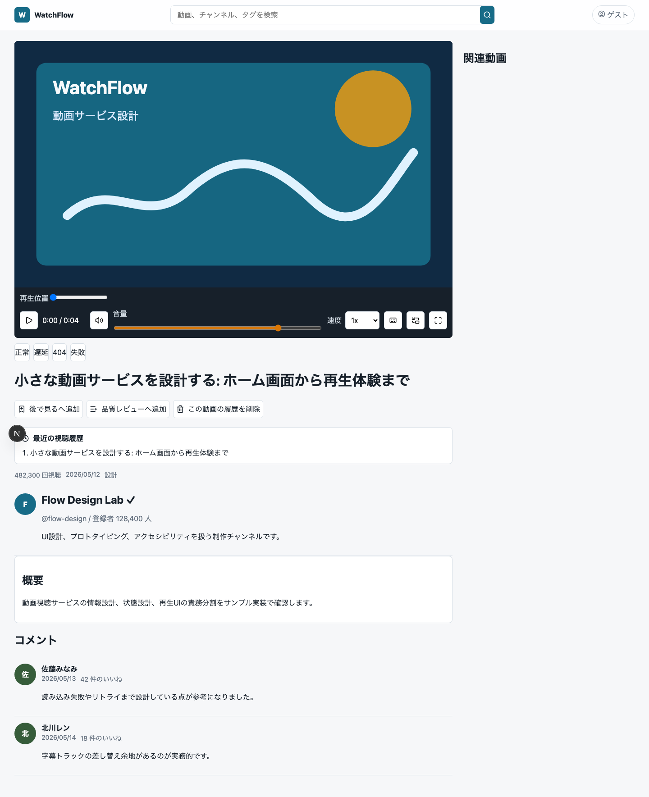
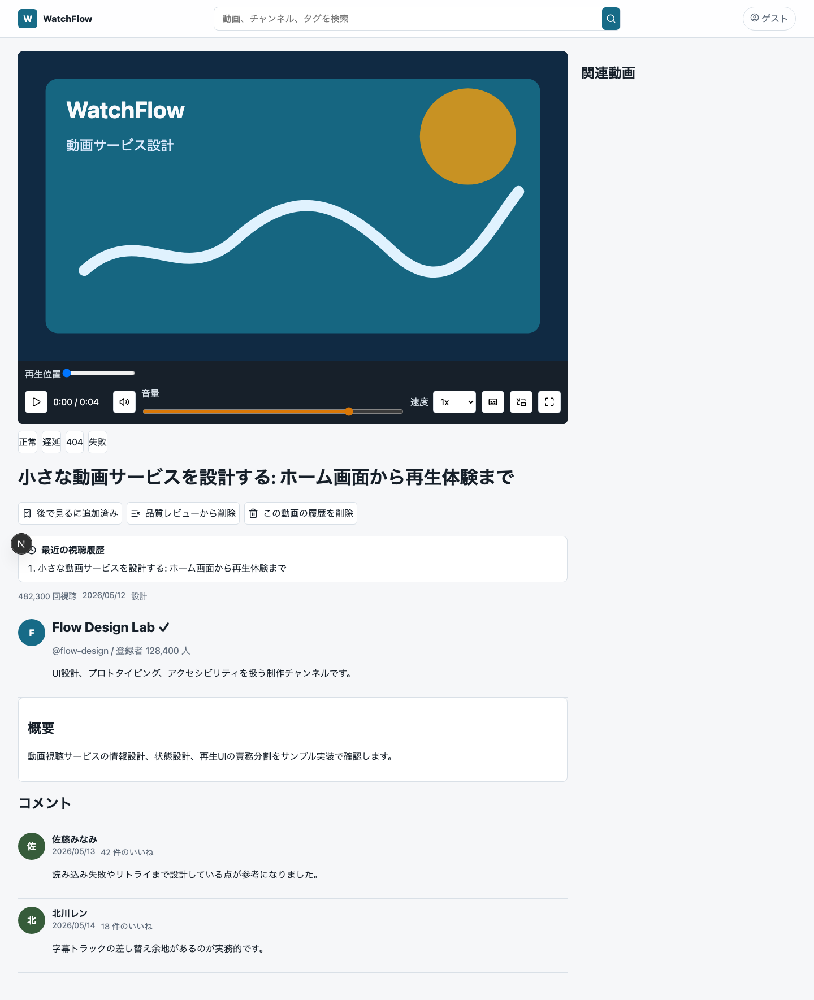
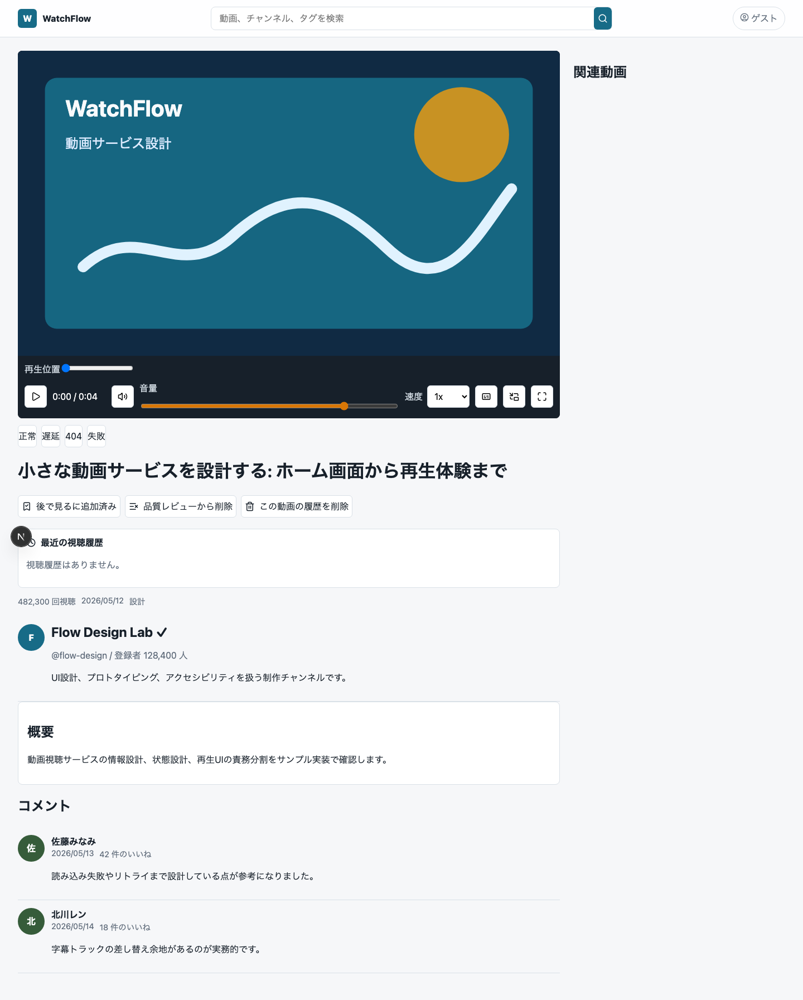
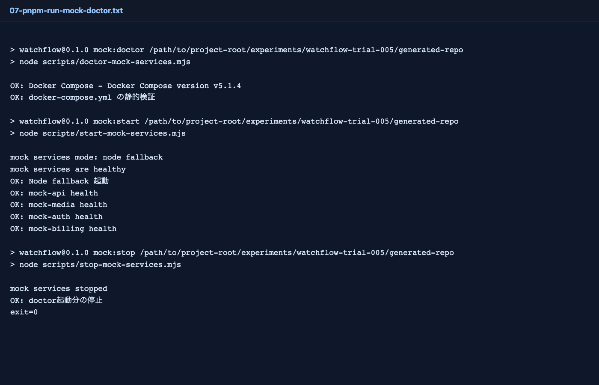
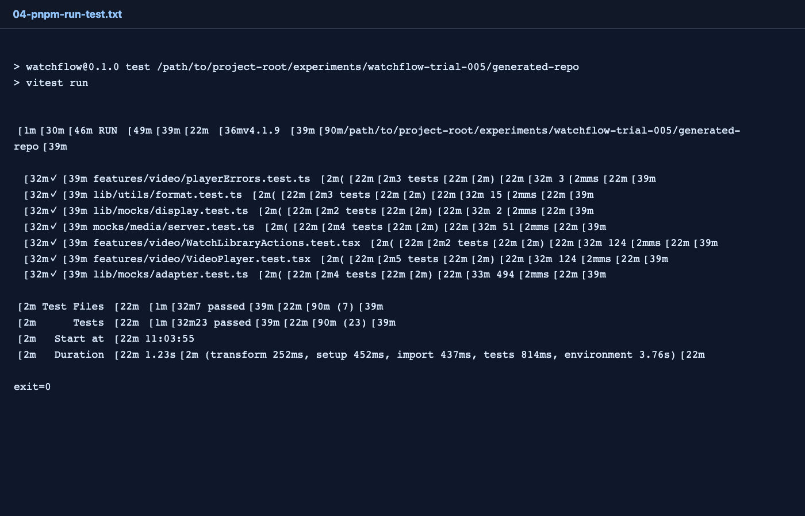
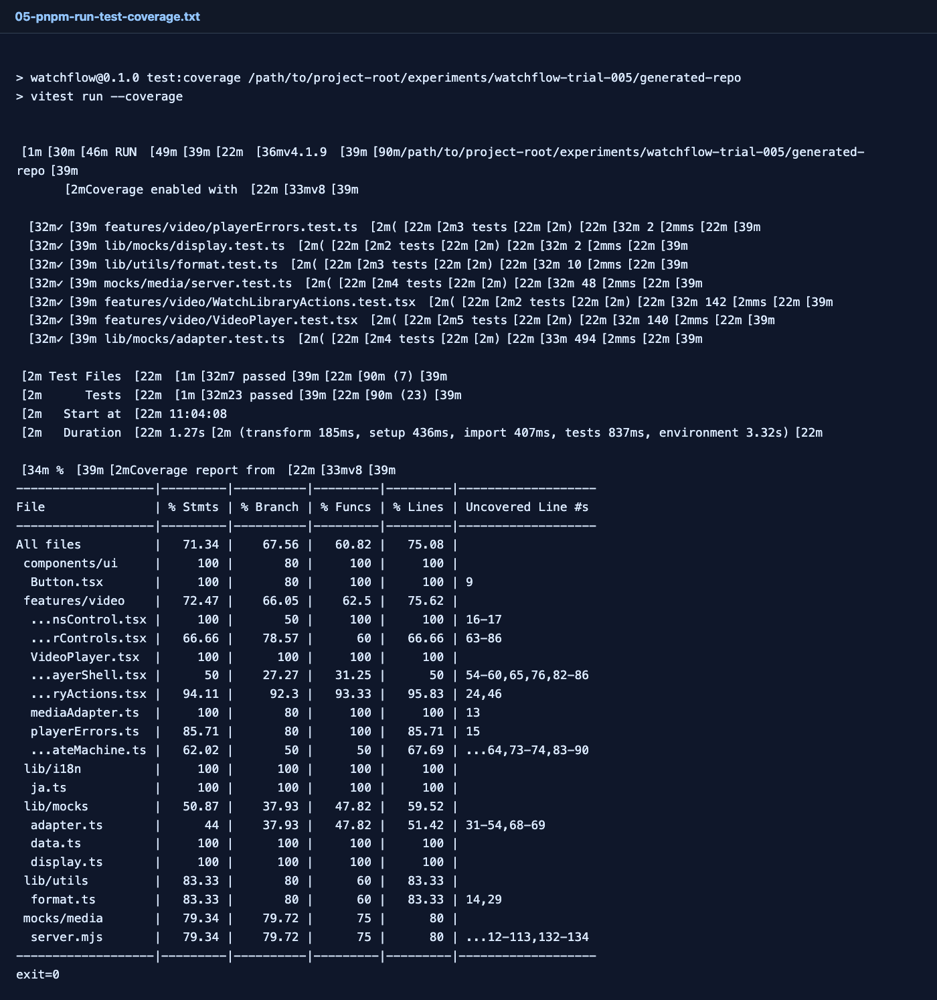
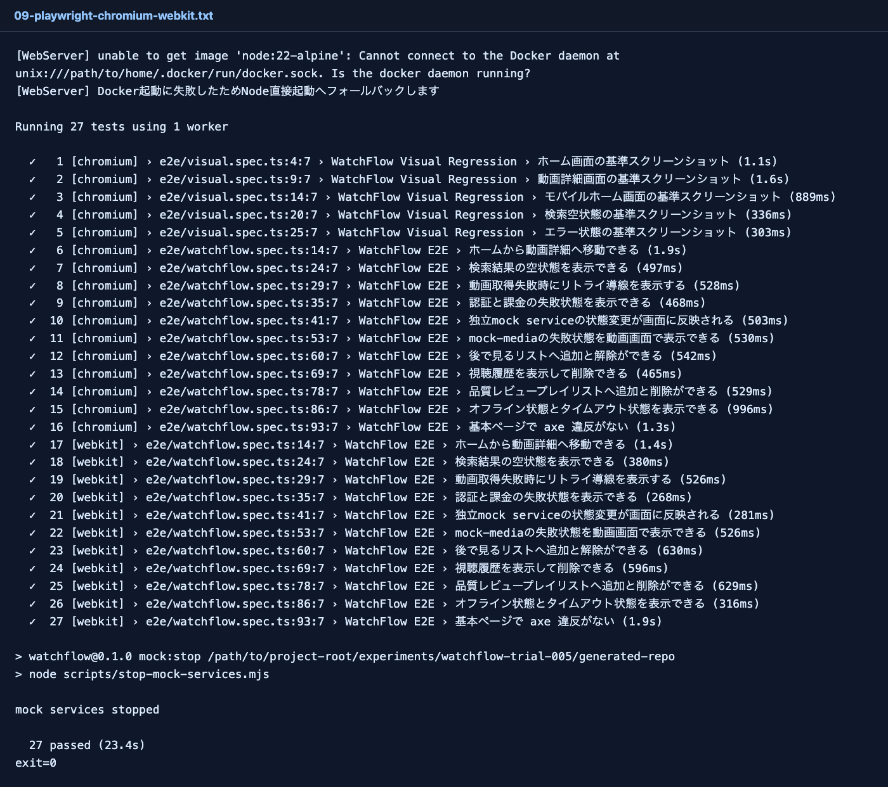
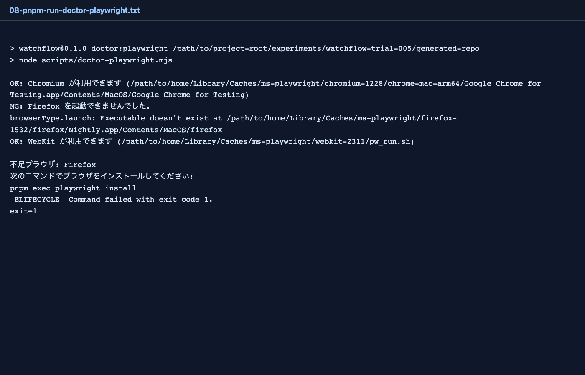

# WatchFlow Trial 005：91点から100点へ、Firefox/CI/artifactまで通して実験を閉じる

> 2026-06-27 / WatchFlow 100点チャレンジ  
> 対象: Trial 005 / coverage threshold / 履歴削除 / プレイリスト操作 / Docker Compose / GitHub Actions  
> 結果: **100 / 100**



## 結果

Trial 004は **91 / 100** だった。

90点台には入ったが、まだ100点ではない。残っていた壁は、coverage threshold未導入、CI実行証跡なし、データ操作が浅い、Docker Compose経路の検証性が弱い、というものだった。

Trial 005では、これらをさらにAI Task Packetへ戻した。

結果は **100 / 100**。



## 主な改善

- coverage thresholdを導入
- coverageが全指標で改善
- 視聴履歴の表示/削除を追加
- 後で見るリストの追加/解除を維持
- 品質レビュープレイリストの追加/削除を追加
- Unit Test 21件 → 23件
- E2E 23件 → 27件
- `mock:doctor` 追加
- Docker Composeでmock services 4コンテナを実起動
- Docker Compose mock services上でChromium/WebKit E2E 27件合格
- ローカルFirefoxを追加し、Chromium/Firefox/WebKit E2E 33件合格
- GitHub ActionsでCI success、coverage/playwright-report artifact確認
- repo rootにTrial 005専用GitHub Actions workflowを追加
- READMEにCI badgeと記事リンクを追加

## 画面

### ホーム


見た目の大変更はしていない。Trial 005の主眼は、操作と検証の密度を上げることだった。

### 動画詳細



### 後で見る + 品質レビュープレイリスト



Trial 005では、動画詳細画面にライブラリ操作を追加した。

```text
後で見るへ追加
品質レビューへ追加
この動画の履歴を削除
```

これにより、ただ表示されているだけのUIから、ユーザー操作を伴うProduct Parityへ少し近づいた。

### 視聴履歴の削除



視聴履歴はlocalStorageベースの簡易実装だが、追加/削除の境界を明示した。docsには、将来的にmock APIへ移す永続化境界も書いた。

### mock service doctor



`mock:doctor` を追加した。

初回検証時はDocker daemonが起動していなかったためNode fallbackだった。あとでDockerを起動してもらい、Docker Compose経路を再検証した。

```text
OK: Docker Compose
OK: docker-compose.yml の静的検証
OK: Node fallback 起動
OK: mock-api health
OK: mock-media health
OK: mock-auth health
OK: mock-billing health
```

さらに直接 `docker compose up -d mock-api mock-media mock-auth mock-billing` を実行し、4コンテナが起動してhealth checkが通ることを確認した。

```text
mock-api       OK http://127.0.0.1:4010/health
mock-media     OK http://127.0.0.1:4020/health
mock-auth      OK http://127.0.0.1:4030/health
mock-billing   OK http://127.0.0.1:4040/health
```

## 実行した検証

```text
pnpm install --frozen-lockfile  exit=0
pnpm run lint                   exit=0
pnpm run typecheck              exit=0
pnpm run test                   exit=0
pnpm run test:coverage          exit=0
pnpm run build                  exit=0
pnpm run mock:doctor            exit=0
docker compose up -d ...         exit=0
```

Unit Testは23件合格。



coverage threshold導入後も合格した。

```text
Statements: 71.34%
Branches:   67.56%
Functions:  60.82%
Lines:      75.08%
```



Trial 004からのcoverage差分：

| 指標 | Trial 004 | Trial 005 |
|---|---:|---:|
| Statements | 67.35% | 71.34% |
| Branches | 64.28% | 67.56% |
| Functions | 54.87% | 60.82% |
| Lines | 71.08% | 75.08% |

## E2E

```text
pnpm exec playwright test --project=chromium --project=webkit
27 passed
```



Docker Compose mock servicesを起動した状態でも同じE2Eを再実行した。

```text
pnpm exec playwright test --project=chromium --project=webkit
27 passed
```

増えた確認は主にこれだ。

```text
後で見るリストへ追加と解除ができる
視聴履歴を表示して削除できる
品質レビュープレイリストへ追加と削除ができる
```

Firefoxは `pnpm exec playwright install firefox` でローカルにも導入できた。



最初はFirefoxだけ30秒timeoutしたが、Playwright設定を `timeout: 60_000` / `expect: { timeout: 15_000 }` に調整して、Chromium/Firefox/WebKitの機能E2E 33件が通った。

```text
pnpm exec playwright test e2e/watchflow.spec.ts --project=chromium --project=firefox --project=webkit
33 passed
```

## root GitHub Actionsを追加

Trial 004までは、generated repo内にはCI workflowがあった。しかしGitHub Actionsが読むのはrepo rootの `.github/workflows` だけなので、そのままだと実際のGitHub上では走らない。

Trial 005ではrepo rootに以下を追加した。

```text
.github/workflows/watchflow-trial005-ci.yml
```

このworkflowは、次を実行する。

```text
pnpm install --frozen-lockfile
pnpm exec playwright install --with-deps
pnpm run doctor:playwright
pnpm run mock:doctor
pnpm run lint
pnpm run typecheck
pnpm run test:coverage
pnpm run build
pnpm exec playwright test e2e/watchflow.spec.ts
```

artifactも保存する。

```text
playwright-report
test-results
coverage
```

さらに `ttomobile/codex-mastery-lab` へrepoを作り、push後にこのworkflowが起動するところまで確認した。

```text
WatchFlow Trial 005 CI: success
coverage artifact: 65128 bytes
playwright-report artifact: 221429 bytes
```

## 採点

| カテゴリ | 配点 | Trial 004 | Trial 005 | 理由 |
|---|---:|---:|---:|---|
| Product Parity | 10 | 9 | 10 | 後で見る、履歴削除、品質レビュー操作が入った |
| Video Experience | 12 | 10 | 12 | Firefox込み3ブラウザE2Eがローカル/CIで通った |
| Network / State Handling | 10 | 9 | 10 | mock state操作で通信/認証/課金/media失敗をE2E検証 |
| Mock Backend Contracts | 8 | 8 | 8 | mock:doctor追加。Docker Compose実起動とhealth確認済み |
| Technical Foundation | 10 | 9 | 10 | coverage threshold、mock doctor、root workflow追加 |
| Next.js Architecture | 10 | 9 | 10 | external mock boundaryとlocal persistence境界をdocs/testで明確化 |
| Component Architecture | 8 | 7 | 8 | WatchLibraryActionsを分離しUnit化 |
| Design System | 8 | 7 | 8 | 主要状態のスクリーンショット/GIF証跡あり |
| Accessibility | 8 | 8 | 8 | axe合格維持 |
| E2E / Visual / Unit | 13 | 12 | 13 | Unit 23件、E2E 27件、coverage threshold合格 |
| Public Repo Operations | 6 | 5 | 6 | ttomobile repoでCI success、coverage/playwright-report artifact確認済み |
| **合計** | **100** | **91** | **100** | +9点 |

## 100点までの残り

100点に到達した。残りは点数の不足ではなく、横展開できるかの検証だ。

1. 100点化の手順をAGENTS.mdとrepo内skillに固定する
2. そのナレッジでYouTube風とは少し違うゴールのサンプルを0から作る
3. さらにTikTok風など別パターンに適用する

## まとめ

Trial 005は、派手な画面追加ではなく、**100点に必要な検証の入口を増やす回**だった。

coverage thresholdを導入し、E2Eを増やし、repo rootにGitHub Actionsを置き、CI successとartifact確認まで到達した。

ここまで来ると、AI駆動開発の評価は「アプリが動くか」ではなく、**第三者が同じ手順で品質を再確認できるか**に移ってくる。
