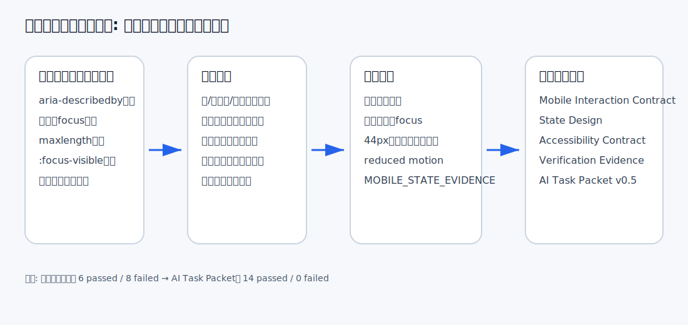
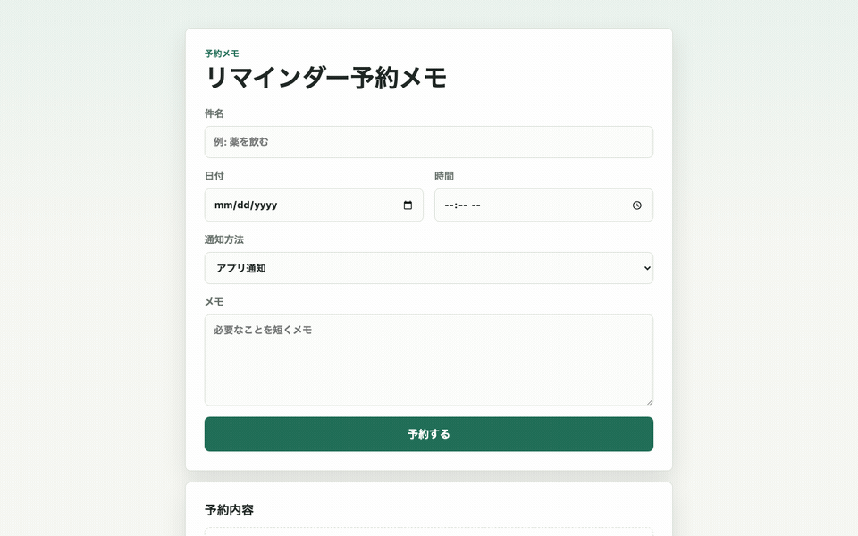
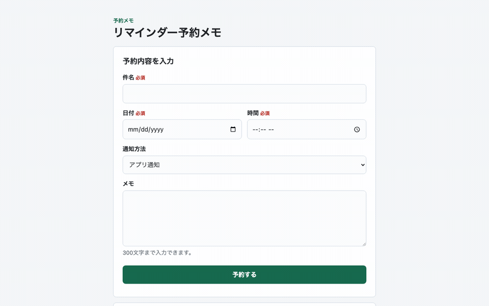

# スマホフォームは「見た目が収まる」だけでは足りない：Mobile Interaction ContractをAI Task Packetへ逆算する

> 2026-06-28 / Codex Mastery Lab 日次ドラフト  
> 想定読了時間: 約10分  
> 種別: Experiment / Template / Failure  
> 将来の書籍章: 第6章 Design Contract、第9章 AI Task Packet、第10章 Verification Evidence、第12章 雑プロンプト vs AI Task Packet



## 前回の振り返り

前回は問い合わせAPIを題材に、`POST /api/contact` が動くだけでは後工程の監査に耐えないことを確認した。雑な指示でもCodexは入力検証やbody size limitを入れたが、CSRF、Origin許可リスト、rate limit、request id、非PII監査ログ、保持方針、エラーレスポンス契約、証拠ファイルは抜けた。

そこから、AIDD-SpecのAI Task Packetに API Security Contract / API Operations Contract を追加した。つまり「もっと安全に」ではなく、後工程が確認できるフィールドへ分解する必要がある、という学びだった。

今回は画面側に戻る。ただし、PCで見たフォームではなく、スマホで使う小さなフォームを扱う。

## 今回やること

今日の題材は、日本語UIの「リマインダー予約メモ」である。件名、日付、時間、通知方法、メモを入力し、送信すると予約内容が表示されるだけの小さな静的Webアプリを作る。

検証したい問いはこれだ。

> Codexに「スマホでも使いやすそうなフォームを作って」と雑に頼んだとき、後工程が必要とする状態設計、エラー復帰、フォーカス移動、タップ領域、モーション配慮、検証証拠は残るのか？

スマホUIは、見た目が縦長に収まっていれば合格に見えやすい。しかし実務ではそこで困る。必須入力でエラーになったとき、どの項目が悪いのか。送信後に画面のどこを読めばいいのか。キーボードだけで操作したとき、フォーカスが見えるのか。後からレビューする人が、何を根拠に「スマホ対応済み」と言えるのか。

料理のレシピで言えば、「おいしく作る」だけでは不十分で、火加減、加熱時間、失敗しやすいポイント、完成の目安が必要になる。スマホフォームも同じで、「スマホでも使いやすそう」ではなく、チェックできる条件に分解する必要がある。

## 仮説

今回の仮説は次の通り。

> Codexは雑プロンプトでも、レスポンシブな見た目、visible label、必須属性、送信後の表示までは作れる。しかし、項目別エラーと `aria-describedby`、エラー/成功/空状態の分離、送信後の結果領域focus、`:focus-visible`、`prefers-reduced-motion`、`MOBILE_STATE_EVIDENCE.md` は、AI Task Packetに明示しない限り抜けやすい。

監査カテゴリは3つに絞った。

1. Design Quality / Mobile Interaction
2. Accessibility
3. Build / Lint / Format / Console

## 実験環境

```text
実行日時: 2026-06-28 09:00:54 JST
Machine: Apple M4 Mac mini / 16GB RAM / 256GB SSD
OS: macOS 26.5.1 / Build 25F80
Codex CLI: codex-cli 0.142.3
Disk: 228Gi total / 136Gi available
Repo: /Users/tto/codex-mastery-lab
Experiment: /Users/tto/codex-mastery-lab/experiments/2026-06-28-mobile-state-contract
```

実験前の `git status --short` は空だった。そこから `experiments/2026-06-28-mobile-state-contract/PLAN.md` を作り、今回の検証計画を固定した。

## Step 1: Codexに雑に作らせる

実際にCodexへ渡した雑プロンプトはこれである。

```text
このgitリポジトリ内で、experiments/2026-06-28-mobile-state-contract/vibe-app に、日本語UIの小さな静的Webアプリを作ってください。

アプリは「リマインダー予約メモ」です。
- 件名、日付、時間、通知方法、メモを入力する
- 送信すると予約内容が画面に表示される
- vanilla HTML/CSS/JavaScriptのみを使う
- 依存パッケージはインストールしない
- 見た目はスマホでも使いやすそうにする
- ただしシンプルでよい
- 変更は vibe-app ディレクトリ内だけに閉じる
- 可能なら node --check も実行して終了する
```

実行コマンドは、Codex CLIの日本語プロンプトをファイル経由で渡した。

```bash
codex exec --sandbox danger-full-access "$(python3 -c 'from pathlib import Path; print(Path("experiments/2026-06-28-mobile-state-contract/prompt-vibe.txt").read_text())')" \
  | tee experiments/2026-06-28-mobile-state-contract/logs/codex-vibe.log
```

なお、最初に日本語プロンプトを直接シェルコマンドへ入れたところ、実行環境のセキュリティスキャンで「confusable Unicode characters」の警告により保留になった。そこで、プロンプトを `prompt-vibe.txt` に保存し、ASCIIのシェルコマンドから読み込む形に変えた。この失敗は今後の運用メモとして重要である。日本語プロンプト自体が悪いのではなく、シェルコマンドに直接長い日本語を埋め込むと、実行環境側の検査に引っかかることがある。

Codexが生成したファイルは次の3つだった。

```text
vibe-app/index.html
vibe-app/style.css
vibe-app/script.js
```

良かった点は多い。

- `lang="ja"` とviewportがある
- visible labelがある
- `type="date"` / `type="time"` を使っている
- 必須項目に `required` がある
- 送信時は `textContent` で結果を描画している
- 入力欄とボタンの `min-height` が48px以上
- 外部依存がない
- `node --check` が成功した

つまり、雑プロンプトだからといって、必ず低品質なものが出るわけではない。Codexは「スマホでも使いやすそう」という曖昧な言葉から、かなり自然な初手を打っている。

## Step 2: バイブ版をブラウザで操作する

操作GIFはこれである。



キャプチャは既存の軽量スクリプトを使った。

```bash
node scripts/capture_app_gif.js \
  experiments/2026-06-28-mobile-state-contract/vibe-app \
  assets/2026-06-28-mobile-state-vibe.gif
```

ブラウザコンソールは次の通り。

```text
No console messages captured.
```

画面を見ると、フォームとしては成立している。入力して送信すると予約内容が出る。スマホ幅でも大きく崩れる雰囲気はない。

しかし、ここで「よし、できた」と言うと危ない。後工程のレビューは、見た目だけではなく、状態遷移と再検証可能性を見る。

## Step 3: 静的監査を作る

今回の監査スクリプトでは、次をチェックした。

- `index.html` / `style.css` / `script.js` があるか
- `lang="ja"` とviewportがあるか
- 主要入力にvisible labelがあるか
- 必須入力のエラー表示先が `aria-describedby` で結び付いているか
- エラー/成功/空状態の live region が分離されているか
- 送信後に結果領域へfocus移動するか
- 件名/メモに `maxlength` があるか
- スマホのタップ領域が44px以上か
- `:focus-visible` があるか
- `prefers-reduced-motion` があるか
- 外部ネットワーク資産を使っていないか
- `console.log` で入力値を出していないか
- `MOBILE_STATE_EVIDENCE.md` があるか
- 証拠ファイルに状態設計/検証コマンド/既知制約があるか

実行コマンド:

```bash
node --check experiments/2026-06-28-mobile-state-contract/vibe-app/script.js
python3 experiments/2026-06-28-mobile-state-contract/audit_mobile_state.py \
  experiments/2026-06-28-mobile-state-contract/vibe-app
```

結果はこうなった。

```text
合格: index.html / style.css / script.js が存在する
合格: 日本語UIで lang=ja と viewport がある
合格: 主要入力に visible label がある
不合格: 必須入力のエラー表示先が aria-describedby で結び付いている
不合格: エラー/成功/空状態の live region が分離されている
不合格: 送信後に結果領域へ focus 移動する
不合格: 件名/メモに maxlength がある
合格: スマホのタップ領域が44px以上で明示されている
不合格: キーボードフォーカスが :focus-visible で見える
不合格: モーションに prefers-reduced-motion がある
合格: 外部ネットワーク資産を使っていない
合格: console.log で入力値を出していない
不合格: MOBILE_STATE_EVIDENCE.md がある
不合格: 証拠ファイルに状態設計/検証コマンド/既知制約がある
SUMMARY: 6 passed / 8 failed
```

ここで重要なのは、不合格の多くが「アプリが動かない」ではないことだ。アプリは動く。見た目も悪くない。だが、後工程が合格にするための説明書が足りない。

## Step 4: 欠陥を標準フォーマットで記録する

代表findingは次の通り。

```yaml
category: Accessibility / Mobile Interaction
finding: バイブ版は必須入力のエラー表示を aria-describedby で入力欄に結び付けておらず、送信成功後も結果領域へfocus移動しなかった。
severity: high
observed_by: audit_mobile_state.py
ideal_state: スマホフォームでは、エラー時に最初の不正項目へfocusし、項目別エラーをaria-describedbyで伝える。成功時は結果領域へfocusし、利用者が次に読む場所を迷わない。
fix_instruction: 必須項目ごとのエラー要素、aria-describedby、aria-invalid、エラーsummary、成功live region、結果領域tabindex=-1とfocus()を追加する。
needed_upstream_info:
  - State Design
  - Accessibility Contract
  - Mobile Interaction Contract
standard_update:
  document: AI Task Packet Standard
  field: mobile_interaction_contract.state_transition_focus
codex_prompt_delta: |
  送信エラー時は最初の不正項目へfocusし、送信成功時は結果領域へfocusする。必須項目のエラーはaria-describedbyで入力欄に結び付ける。
verification:
  command: python3 experiments/2026-06-28-mobile-state-contract/audit_mobile_state.py experiments/2026-06-28-mobile-state-contract/fixed-app
  expected: SUMMARY: 14 passed / 0 failed
```

もう1つは証拠ファイルである。

```yaml
category: Verification Evidence
finding: バイブ版には、空状態、エラー状態、成功状態、スマホ操作配慮、検証コマンド、既知制約を記録した証拠ファイルがなかった。
severity: medium
ideal_state: 後工程のレビュー担当が、チャットログではなくリポジトリ内の証拠ファイルから状態設計と検証結果を確認できる。
fix_instruction: fixed-app/MOBILE_STATE_EVIDENCE.md を作り、状態設計、スマホ操作配慮、検証コマンド、既知制約を日本語で記録する。
needed_upstream_info:
  - Verification Evidence
  - Definition of Done
standard_update:
  document: AI Task Packet Standard
  field: verification_evidence.mobile_state_file
```

## Step 5: AI Task Packet v0.5を作る

改善版では、Codexに次を渡した。全文は `experiments/2026-06-28-mobile-state-contract/AI_TASK_PACKET_v0.5.md` に保存している。

```markdown
## State Design
- 空状態: まだ予約がないこと、入力後に予約できることを説明する。
- エラー状態: 必須項目ごとにエラーを表示し、aria-describedbyで入力欄と結び付ける。
- 成功状態: 成功メッセージと予約内容を表示し、結果領域へfocus移動する。
- 編集復帰: 再編集できる導線を置く。

## Accessibility Contract
- すべての入力にvisible labelを置く。
- 必須項目のエラー表示は aria-describedby で結ぶ。
- エラー/成功状態を aria-live="polite" の領域で知らせる。
- 送信後は結果領域に tabindex="-1" を付けて `.focus()` する。
- キーボードフォーカスは `:focus-visible` で明確に見える。

## Mobile Interaction Contract
- 主要タップ領域は44px以上。
- 360px幅でも横スクロールしない。
- 入力欄はスマホキーボードに適した type/inputmode/autocomplete を使う。
- ボタンは画面下部に近い位置でも押しやすい余白を持つ。
- モーションを使う場合は `prefers-reduced-motion` を用意する。使わない場合も方針をCSSまたは証拠ファイルに明記する。

## Verification Evidence
`fixed-app/MOBILE_STATE_EVIDENCE.md` を作成し、次を日本語で記録する。
- 空状態
- エラー状態
- 成功状態
- スマホ操作配慮
- 検証コマンド
- 既知制約
```

実行コマンド:

```bash
codex exec --sandbox danger-full-access "$(python3 -c 'from pathlib import Path; print(Path("experiments/2026-06-28-mobile-state-contract/prompt-fixed.txt").read_text())')" \
  | tee experiments/2026-06-28-mobile-state-contract/logs/codex-fixed.log
```

Codexは `fixed-app/` に次を作った。

```text
fixed-app/index.html
fixed-app/style.css
fixed-app/script.js
fixed-app/MOBILE_STATE_EVIDENCE.md
```

## Step 6: 改善版をブラウザで操作する

改善版の操作GIFはこれである。



ブラウザコンソールはバイブ版と同じく静かだった。

```text
No console messages captured.
```

画面上は、バイブ版より少し説明的になった。必須ラベル、状態表示、再編集ボタンが増えたため、単純な見た目だけなら少し堅く見える。しかし、後工程にとってはこの「説明的であること」が価値になる。

## Step 7: 再監査する

再実行したコマンド:

```bash
node --check experiments/2026-06-28-mobile-state-contract/fixed-app/script.js
python3 experiments/2026-06-28-mobile-state-contract/audit_mobile_state.py \
  experiments/2026-06-28-mobile-state-contract/fixed-app
```

結果:

```text
合格: index.html / style.css / script.js が存在する
合格: 日本語UIで lang=ja と viewport がある
合格: 主要入力に visible label がある
合格: 必須入力のエラー表示先が aria-describedby で結び付いている
合格: エラー/成功/空状態の live region が分離されている
合格: 送信後に結果領域へ focus 移動する
合格: 件名/メモに maxlength がある
合格: スマホのタップ領域が44px以上で明示されている
合格: キーボードフォーカスが :focus-visible で見える
合格: モーションに prefers-reduced-motion がある
合格: 外部ネットワーク資産を使っていない
合格: console.log で入力値を出していない
合格: MOBILE_STATE_EVIDENCE.md がある
合格: 証拠ファイルに状態設計/検証コマンド/既知制約がある
SUMMARY: 14 passed / 0 failed
```

雑プロンプト版は `6 passed / 8 failed`、AI Task Packet版は `14 passed / 0 failed` だった。

## 逆算: 前工程で何を渡すべきだったか

今回の結果を逆算すると、最初からCodexへ渡すべきだった情報は次である。

| 欠陥 | 必要だった前工程情報 | AIDD-Spec成果物 | AI Task Packet項目 |
|---|---|---|---|
| 項目別エラーがない | 必須項目ごとのエラー文言と接続方法 | Accessibility Contract | `aria-describedby`, `aria-invalid` |
| 成功後に読む場所が分からない | 状態遷移後のfocus方針 | Mobile Interaction Contract | `state_transition_focus` |
| スマホ操作の証拠がない | 監査で見るviewport/tap/focus条件 | Verification Evidence | `MOBILE_STATE_EVIDENCE.md` |
| maxlengthがない | 入力制約と安全な描画 | Security / Privacy Contract | `input_validation`, `safe_rendering` |
| focus-visible / reduced-motionがない | キーボード・モーション配慮 | Mobile Interaction Contract | `reduced_motion_policy` |

つまり、必要なのは「スマホ対応してください」ではない。後工程がチェックできる形で、少なくとも次を渡す必要がある。

```yaml
mobile_interaction_contract:
  target_viewports:
    - "360px mobile width without horizontal scroll"
  touch_targets: "Primary inputs and buttons must be at least 44px high; prefer 48px in forms."
  input_keyboard_policy:
    - "Use type=date for date input and type=time for time input when acceptable."
    - "Use inputmode and autocomplete intentionally."
  state_transition_focus: "On validation error, focus first invalid field. On success, focus result panel with tabindex=-1."
  reduced_motion_policy: "Provide prefers-reduced-motion or document no-motion policy."
  mobile_overflow_policy: "Single column by default at 360px; no horizontal scroll."
```

## AIDD-Specへの反映

`standards/aidd-spec-ai-task-packet-standard-v0.1.md` を更新し、次を追加した。

- `mobile_interaction_contract.target_viewports`
- `mobile_interaction_contract.touch_targets`
- `mobile_interaction_contract.input_keyboard_policy`
- `mobile_interaction_contract.state_transition_focus`
- `mobile_interaction_contract.reduced_motion_policy`
- `mobile_interaction_contract.mobile_overflow_policy`
- `verification_evidence.mobile_state_file` の考え方
- AI Task Packet Liteテンプレートの Mobile Interaction Contract欄

AIDD Control Planeにするなら、これは自由記述ではなくフォーム化できる。

- 画面種別: フォーム
- 対象viewport: 360px / 720px
- 必須入力: 件名、日付、時間
- エラー時focus: 最初の不正項目
- 成功時focus: 結果領域
- タップ領域: 44px以上
- 証拠ファイル: 必須

これを入力すると、AI Task Packetと監査スクリプトの雛形が自動生成される、というのがSaaS化の仮説である。

## 実務で使うならどうするか

小さなフォームでも、最初から全部を重く書く必要はない。しかし、最低限のチェックリストは必要だ。

- 画面の空状態、エラー状態、成功状態を書いたか
- 必須項目ごとのエラー文言を書いたか
- `aria-describedby` でエラーと入力欄を結んだか
- エラー時と成功時のfocus移動を書いたか
- スマホのタップ領域を数値で書いたか
- 360px幅で横スクロールしない条件を書いたか
- 検証コマンドと証拠ファイルを要求したか

この程度なら、駆け出し〜中堅の開発者でも日々の実装単位に入れられる。むしろ、後からレビューで指摘するより、最初にAI Task Packetへ入れる方が安い。

## 今回の学び

第一に、Codexは雑プロンプトでもかなり良い。今回も、日本語UI、スマホらしい余白、`textContent`、48px以上の入力欄までは自律的に入った。

第二に、後工程が必要とする「状態遷移の説明」は抜ける。特に、成功後にどこへfocusするか、エラー時にどの項目へ戻すか、証拠ファイルとして何を残すかは、AIが勝手に完璧には補わない。

第三に、スマホ対応は見た目の問題だけではない。利用者が指で押す、キーボードで入力する、エラーから戻る、送信後に読む、という一連の操作説明が必要である。

## 明日から使えるチェックリスト

- [ ] 「スマホ対応」ではなく、対象viewportを数値で書く
- [ ] タップ領域は44px以上、できれば48pxと明記する
- [ ] 必須入力のエラーは `aria-describedby` で入力欄に結ぶ
- [ ] エラー時は最初の不正項目、成功時は結果領域へfocusする
- [ ] `:focus-visible` と `prefers-reduced-motion` を確認する
- [ ] 状態設計と検証結果を証拠ファイルに残す

## 次回検証

次回は、今回のMobile Interaction Contractをもう少し実HTTPの検証に寄せたい。候補は、問い合わせAPIで Origin拒否 / CSRF拒否 / rate limit 429 のnegative testを実HTTPで自動化すること。UIの状態設計とAPIの失敗状態をつなげると、AIDD-Specの `State Design` と `API Operations Contract` がより実務に近づく。

## 付録: 生ログ / 参照ファイル

- Experiment: `/Users/tto/codex-mastery-lab/experiments/2026-06-28-mobile-state-contract/`
- Vibe prompt: `/Users/tto/codex-mastery-lab/experiments/2026-06-28-mobile-state-contract/prompt-vibe.txt`
- Fixed Task Packet: `/Users/tto/codex-mastery-lab/experiments/2026-06-28-mobile-state-contract/AI_TASK_PACKET_v0.5.md`
- Vibe audit log: `/Users/tto/codex-mastery-lab/experiments/2026-06-28-mobile-state-contract/logs/vibe-audit.log`
- Fixed audit log: `/Users/tto/codex-mastery-lab/experiments/2026-06-28-mobile-state-contract/logs/fixed-audit.log`
- Vibe GIF: `/Users/tto/codex-mastery-lab/assets/2026-06-28-mobile-state-vibe.gif`
- Fixed GIF: `/Users/tto/codex-mastery-lab/assets/2026-06-28-mobile-state-fixed.gif`
- Standard updated: `/Users/tto/codex-mastery-lab/standards/aidd-spec-ai-task-packet-standard-v0.1.md`
