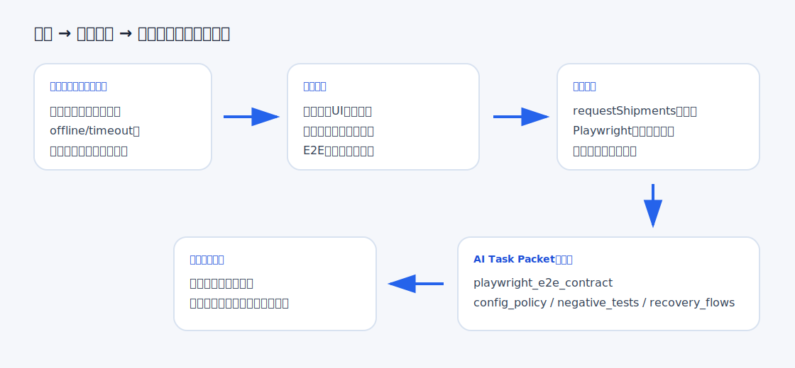
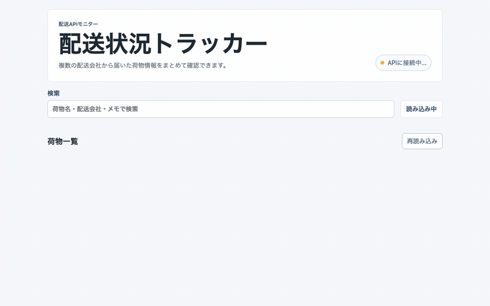
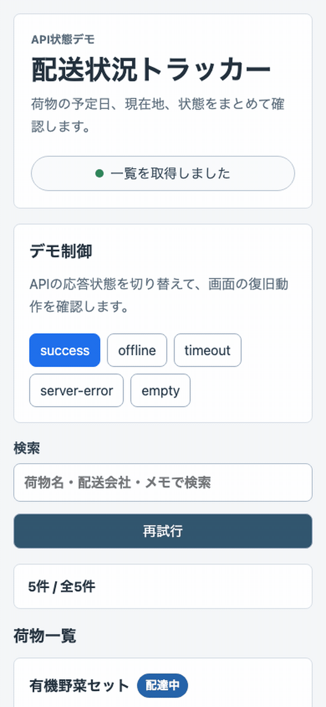

# Playwrightで失敗状態を本当に触る：API状態E2E契約をAI Task Packetへ逆算する

> 2026-06-30 / Codex Mastery Lab 日次ドラフト  
> 想定読了時間: 約10分  
> 種別: Experiment / Template / Failure  
> 将来の書籍章: 第7章 System Contract、第9章 AI Task Packet、第10章 Verification Evidence、第12章 雑プロンプト vs AI Task Packet、第16章 AI実装レビューを3層に分ける



## 前回の振り返り

前回は「読書ログ同期ビューア」を題材に、APIから取得するUIの失敗状態を見た。雑な依頼でも、CodexはAPI読込風の遅延、一覧、検索、同期状態を自然に作った。しかし、offline、timeout、server error、再試行、入力保持、証拠ファイルは抜けた。

そこで AI Task Packet に `api_failure_state_contract` を追加した。改善版では、状態切替UI、再試行ボタン、AbortController風のtimeout、失敗時の検索入力保持、`API_FAILURE_STATE_EVIDENCE.md` まで出た。静的監査では、雑プロンプト版が `10 passed / 6 failed`、改善版が `16 passed / 0 failed` だった。

ただし、前回の最後に残った課題がある。監査はまだ文字列中心だった。`offline` という文字列があることと、利用者がブラウザ上でofflineに切り替えて復帰できることは違う。料理のレシピで言えば、「焦げたら火を弱める」と書いてあるだけで、実際に焦げかけた鍋を戻せるか試していない状態に近い。

## 今回やること

今日の問いはこれである。

> API失敗状態を、静的監査ではなくPlaywrightで実際に操作して確認する契約をAI Task Packetに入れると、Codexの成果物は後工程で検査しやすくなるか？

題材は日本語UIの「配送状況トラッカー」にした。荷物名、配送会社、予定日、現在地、状態、メモを表示し、検索できる小さな静的Webアプリである。

今回の比較は2つ。

1. 雑プロンプト版: 「APIから配送状況一覧を読み込む雰囲気」とだけ頼む。
2. 指示見直し版: API Failure State Contractに加えて、Playwright E2E Contractを渡す。

監査カテゴリは3つに絞った。

- Requirement Fit / Failure State
- Test Plan / Playwright E2E
- Verification Evidence

## 仮説

仮説は次の通り。

> Codexは雑プロンプトでも、成功状態の一覧表示と検索は作る。しかし、offline / timeout / server-error / empty をブラウザで切り替えるUI、検索語保持、前回一覧保持、再試行、Playwrightの日本語E2E、証拠ファイルは、AI Task Packetで明示しない限り抜けやすい。

現場では「テストも書いて」と言うだけでは足りない。何をテストするか、どのブラウザで、どのURLで、どの状態を切り替え、どの入力が残るべきかまで決めないと、AIはhappy pathだけを確認して終わりがちである。

## 実験環境

```text
実行日時: 2026-06-30 09:01 JST
Machine: Apple M4 Mac mini / 16GB RAM / 256GB SSD
OS: macOS 26.5.1 / Build 25F80
Codex CLI: codex-cli 0.142.3
Disk: 228Gi total / 132Gi available
Repo: /path/to/project-root
Experiment: /path/to/project-root/experiments/2026-06-30-playwright-api-state
```

最初に `codex` がPATHに見つからず、`/path/to/home/.local/bin/codex` には存在することを確認した。cron実行ではPATHが普段のシェルと違うため、以後は絶対パスでCodex CLIを呼んだ。これも運用上の学びである。

## Step 1: Codexに雑に作らせる

実際にCodexへ渡した雑プロンプトはこれである。

```text
このgitリポジトリ内で、experiments/2026-06-30-playwright-api-state/vibe-app に、日本語UIの小さな静的Webアプリを作ってください。

アプリは「配送状況トラッカー」です。
- APIから配送状況一覧を読み込んで表示する雰囲気にしてください
- 検索入力で荷物名、配送会社、メモを絞り込めるようにしてください
- 荷物には荷物名、配送会社、予定日、現在地、状態、メモを表示してください
- vanilla HTML/CSS/JavaScriptのみを使ってください
- 依存パッケージはインストールしないでください
- UI文言とサンプルデータは日本語にしてください
- 見た目はシンプルでよいですが、スマホでも読めるようにしてください
- 変更は vibe-app ディレクトリ内だけに閉じてください
- 可能なら node --check も実行して終了してください
```

実行コマンド:

```bash
PROMPT=$(< experiments/2026-06-30-playwright-api-state/prompt-vibe.txt)
/path/to/codex exec --sandbox danger-full-access "$PROMPT" \
  | tee experiments/2026-06-30-playwright-api-state/logs/codex-vibe.log
```

生成されたファイルは3つだった。

```text
vibe-app/index.html
vibe-app/styles.css
vibe-app/app.js
```

Codexの自己確認では、`node --check experiments/2026-06-30-playwright-api-state/vibe-app/app.js` が成功した。

ブラウザ操作GIFはこれである。



コンソールログも静かだった。

```text
No console messages captured.
```

見た目は悪くない。配送状況カードが並び、検索もできる。`APIに接続中...` から `API同期済み` へ変わる。ここだけ見ると、「APIから取得する画面」として十分に見える。

しかしコードを読むと、実際には `mockFetchShipments()` が450ms後に成功データを返すだけだった。offline、timeout、server-error、emptyを切り替える入口はない。失敗時の再試行や検索語保持の確認もできない。つまり、利用者が困る場面を後工程が触れない。

## Step 2: 静的監査を作る

今回の監査スクリプトでは、次を確認した。

- `index.html / app.js / styles.css` があるか
- `lang="ja"` と viewport があるか
- API境界関数 `requestShipments` があるか
- success / offline / timeout / server-error / empty を扱うか
- AbortControllerまたは明示timeoutがあるか
- 再試行ボタンがあるか
- 失敗時の入力保持・前回一覧保持方針があるか
- `aria-live` があるか
- Playwright E2Eテストがあるか
- 証拠ファイルがあるか

実行結果:

```text
# static audit vibe
合格: index.html / app.js / styles.css が存在する
合格: 日本語UIとして lang=ja と viewport がある
不合格: API境界関数 requestShipments がある
不合格: success / offline / timeout / server-error / empty を扱う
合格: AbortController または明示timeoutがある
不合格: 再試行ボタンがある
不合格: 失敗時の入力保持・前回一覧保持方針がある
合格: aria-live で状態変化を伝える
合格: Playwright E2Eテストがある
合格: E2Eテスト名が日本語で、失敗状態を検証する
不合格: PLAYWRIGHT_API_STATE_EVIDENCE.md がある
SUMMARY: 6 passed / 5 failed
```

ここで監査スクリプト側の甘さも見えた。`tests/` ディレクトリは後から改善版のために作ったため、vibe-app監査でも「Playwright E2Eテストがある」と判定されてしまった。本来はappごとに紐づく証拠として分けるべきである。失敗を隠さず書くなら、今日の静的監査は「vibeとfixedを完全分離できていない」という欠陥を含んでいる。

それでも、重要な欠陥は見えた。雑プロンプト版には、失敗状態を実際に動かすための契約がない。

## Step 3: 欠陥を標準フォーマットで記録する

代表findingは次の通り。

```yaml
category: Test Plan / Playwright E2E
finding: 雑プロンプト版は成功状態の一覧と検索は実装したが、offline / timeout / server-error / empty をブラウザで切り替えて検証するUI、再試行、検索語保持、前回一覧保持、Playwrightテスト、証拠ファイルがなかった。
severity: high
observed_by: browser operation, audit_playwright_api_state.py
ideal_state: API依存UIは、失敗状態を画面で再現でき、Playwrightで利用者操作として検証できる。E2Eは日本語テスト名で、入力保持、前回一覧保持、再試行復帰を確認する。
fix_instruction: requestShipments({ scenario, signal }) をUI描画から分離し、success/offline/timeout/server-error/empty の切替UI、再試行ボタン、aria-live、Playwright E2E、PLAYWRIGHT_API_STATE_EVIDENCE.mdを追加する。
needed_upstream_info:
  - API Failure State Contract
  - Playwright E2E Contract
  - Verification Evidence
standard_update:
  document: AI Task Packet Standard
  field: playwright_e2e_contract
codex_prompt_delta: |
  API失敗状態は文字列監査だけでなく、Playwrightで実際に切り替え、検索語保持・前回一覧保持・再試行復帰を検証する。
verification:
  command: pnpm exec playwright test --config=experiments/2026-06-30-playwright-api-state/tests/playwright.config.js api-state-e2e.spec.js --project=chromium
  expected: 6 passed
```

もう1つのfindingは、実行コマンドと設定の不一致である。

```yaml
category: Verification Evidence / Tooling
finding: AI Task Packetで指定した `pnpm exec playwright test ... --project=chromium` は、rootにPlaywright configがないため `Project(s) "chromium" not found` で失敗した。
severity: medium
ideal_state: E2E契約には、テストファイルだけでなく、どのPlaywright configを使い、どのproject名が存在するかを含める。
needed_upstream_info:
  - Playwright config policy
  - Required command contract
standard_update:
  document: AI Task Packet Standard
  field: playwright_e2e_contract.config_policy
```

## Step 4: AI Task Packetとして再指示する

指示見直し版では、Codexに次の要点を渡した。

```text
# API Failure State Contract
- 画面上で success / offline / timeout / server-error / empty を切り替えられるデモ制御を置く。
- timeout は AbortController または明示的な timeout branch で表現する。
- offline / timeout / server-error では、日本語で「何が起きたか」と「次に何をすればよいか」を表示する。
- 失敗時も検索入力の値と直前に取得済みの一覧を保持する。
- 再試行ボタンを置き、現在選択中の scenario で再取得できる。
- success に戻したら一覧が復帰する。
- 状態変化は aria-live で伝える。
- 利用者入力やメモを console.log しない。

# Playwright E2E Contract
- experiments/2026-06-30-playwright-api-state/tests/api-state-e2e.spec.js を作る。
- Playwright の @playwright/test を使う。root の既存 devDependency を使い、新規installしない。
- test名は日本語。
- file:// で fixed-app/index.html を開く。
- 少なくとも次を検証する。
  1. success 初期表示で荷物一覧が表示される。
  2. 検索語を入力した後、offline に切り替えても検索語が残り、エラー文言と再試行ボタンが見える。
  3. timeout に切り替えると timeout の日本語文言が出る。
  4. server-error に切り替えると server error の日本語文言が出る。
  5. empty に切り替えると空状態が出る。
  6. success に戻して再試行すると一覧が復帰する。
```

実行コマンド:

```bash
PROMPT=$(< experiments/2026-06-30-playwright-api-state/prompt-fixed.txt)
/path/to/codex exec --sandbox danger-full-access "$PROMPT" \
  | tee experiments/2026-06-30-playwright-api-state/logs/codex-fixed.log
```

Codexが生成したファイルは次の通り。

```text
fixed-app/index.html
fixed-app/styles.css
fixed-app/app.js
fixed-app/PLAYWRIGHT_API_STATE_EVIDENCE.md
tests/api-state-e2e.spec.js
tests/playwright.config.js
```

改善版の操作GIFはこれである。



コンソールログは静かだった。

```text
No console messages captured.
```

改善版は、画面上で `success / offline / timeout / server-error / empty` を切り替えられる。検索語に「コーヒー」を入れた状態でofflineにすると、検索語と直前一覧を保持したまま、「ネットワークに接続できません」「通信環境を確認し、接続が戻ったら再試行してください」と表示される。server-errorやtimeoutも、日本語の次アクション付きで出る。

## Step 5: 再検証する

実行したコマンドと結果は次の通り。

```text
# node checks
node --check experiments/2026-06-30-playwright-api-state/vibe-app/app.js
node --check experiments/2026-06-30-playwright-api-state/fixed-app/app.js
node --check experiments/2026-06-30-playwright-api-state/capture_api_state_gif.js

# static audit fixed
合格: index.html / app.js / styles.css が存在する
合格: 日本語UIとして lang=ja と viewport がある
合格: API境界関数 requestShipments がある
合格: success / offline / timeout / server-error / empty を扱う
合格: AbortController または明示timeoutがある
合格: 再試行ボタンがある
合格: 失敗時の入力保持・前回一覧保持方針がある
合格: aria-live で状態変化を伝える
合格: Playwright E2Eテストがある
合格: E2Eテスト名が日本語で、失敗状態を検証する
合格: PLAYWRIGHT_API_STATE_EVIDENCE.md がある
SUMMARY: 11 passed / 0 failed
```

Playwrightは一度失敗した。AI Task Packetで指定した厳密なコマンドは、rootにPlaywright projectがないため失敗した。

```text
Error: Project(s) "chromium" not found. Available projects: ""
```

これは大事な失敗である。テストファイルを作るだけでは足りない。`--project=chromium` と書くなら、そのprojectを定義したconfigも必要である。Codexは `tests/playwright.config.js` を作っていたので、configを明示したコマンドでは通った。

```text
pnpm exec playwright test --config=experiments/2026-06-30-playwright-api-state/tests/playwright.config.js api-state-e2e.spec.js --project=chromium

Running 6 tests using 1 worker

✓ success初期表示で荷物一覧が表示される
✓ 検索語入力後にofflineへ切り替えても検索語と一覧を保持し、エラーと再試行を表示する
✓ timeoutへ切り替えるとタイムアウトの日本語文言が表示される
✓ server-errorへ切り替えるとサーバーエラーの日本語文言が表示される
✓ emptyへ切り替えると空状態が表示される
✓ successへ戻して再試行すると一覧が復帰する

6 passed (2.4s)
```

## 逆算: 前工程で何を渡すべきだったか

今回の欠陥を逆算すると、こうなる。

| 欠陥 | 必要だった前工程情報 | AIDD-Spec成果物 | AI Task Packetに入れるべき項目 |
|---|---|---|---|
| 成功画面しか実際に触れない | 失敗状態の操作シナリオ | API Failure State Contract | success / offline / timeout / server-error / empty |
| 失敗時に検索語が残るか不明 | 保持すべき入力一覧 | Playwright E2E Contract | preserved_inputs |
| 前回一覧を消してよいか不明 | 復旧体験の方針 | State Design | last known results policy |
| 再試行復帰が未検証 | 復帰フロー | Playwright E2E Contract | recovery_flows |
| テストコマンドが設定不足で失敗 | configの置き場所とproject名 | Quality Gate / Verification Evidence | config_policy |

つまり、最初からCodexに渡すべきだったものは、「テストも書いて」ではなかった。

```text
APIを呼ぶUIでは、success/offline/timeout/server-error/emptyをブラウザで切り替えられるようにする。Playwrightで、検索語保持、前回一覧保持、エラー文言、再試行、success復帰を利用者操作として検証する。E2Eの実行コマンドは、Playwright configとproject名が一致する形で証拠ファイルに残す。
```

## AIDD-Specへの反映

更新した標準ドキュメントは次の2つである。

- `standards/aidd-spec-ai-task-packet-standard-v0.1.md`
- `standards/templates/ai-task-packet-template-v0.1.md`

追加した項目は `playwright_e2e_contract` である。

```yaml
playwright_e2e_contract:
  target_browsers:
    - chromium
  launch_url: "file:// or local dev server URL used by the test"
  state_scenarios:
    - success_initial_list_visible
    - offline_keeps_search_and_previous_results
    - timeout_shows_recoverable_message
    - server_error_shows_recoverable_message
    - empty_shows_empty_state
  preserved_inputs:
    - search query
  recovery_flows:
    - "Switch from error scenario to success and click retry; list must return."
  negative_tests:
    - "Do not clear user input on API failure."
  config_policy: "If root Playwright config has no named project, create a scoped config near the test and document the exact command."
```

AIDD Control Planeにするなら、API状態契約を入力した時点で「どの状態をE2Eで確認するか」をチェックボックス化する。さらに、生成されたテストコマンドが本当に通るか、configとproject名を機械的に検査する。今日の失敗は、SaaS化した場合の良い機能仮説になった。

## 実務で使うならどうするか

実務でAPI依存UIをAIに作らせるなら、次の順番で依頼する。

1. 画面に必要な状態を列挙する。
2. 失敗状態で保持すべき入力と表示を決める。
3. 復帰操作を決める。
4. Playwrightで確認するユーザー操作を書く。
5. 実行コマンドとconfigの置き場所を指定する。
6. 証拠ファイルに、通ったコマンドと既知制約を残す。

「APIから取って表示して」と頼むだけでは、AIは成功時の見た目を作りやすい。だが、後工程が欲しいのは、壊れたときに何が起きるか、利用者がどう戻れるか、テストで再現できるかである。

## 今回の学び

1つ目の学びは、雑プロンプトでも成功画面はかなり自然に作られることだ。カード、検索、同期済み表示、レスポンシブは問題なく出た。

2つ目の学びは、E2E契約を渡すと、CodexはテストしやすいUI構造を作ることだ。状態切替ボタン、`requestShipments({ scenario, signal })`、`aria-live`、証拠ファイルが揃った。

3つ目の学びは、テストコマンドも仕様の一部だということだ。`--project=chromium` と書いても、configがなければ動かない。AI Task Packetには、テストファイル名だけでなく、Playwright config policyも必要である。

## 明日から使えるチェックリスト

- [ ] API依存UIに success / empty / offline / timeout / server-error を定義したか
- [ ] 失敗状態をブラウザ上で切り替える方法があるか
- [ ] 検索語や入力値を失敗時に保持するか決めたか
- [ ] 前回取得済み一覧を残すか消すか決めたか
- [ ] 再試行でsuccessへ復帰するE2Eを書いたか
- [ ] Playwright configとproject名が実行コマンドと一致しているか
- [ ] 証拠ファイルに、通ったコマンドと既知制約を残したか

## 次回検証

次回は、この `playwright_e2e_contract` をAIDD Control Planeの入力フォームへつなげたい。API状態を選ぶと、必要なE2Eシナリオ、保持入力、復帰フロー、config policyが自動生成されるかを検証する。Control Planeが「AIに頼む前のチェックリスト」から「実行可能な検証計画」へ進めるかを見たい。

## 付録: 生ログ / 参照ファイル

- Experiment path: `experiments/2026-06-30-playwright-api-state/`
- Vibe Codex log: `experiments/2026-06-30-playwright-api-state/logs/codex-vibe.log`
- Fixed Codex log: `experiments/2026-06-30-playwright-api-state/logs/codex-fixed.log`
- Verification log: `experiments/2026-06-30-playwright-api-state/logs/verification.log`
- Capture log: `experiments/2026-06-30-playwright-api-state/logs/capture.log`
- Vibe GIF: `assets/2026-06-30-playwright-api-state-vibe.gif`
- Fixed GIF: `assets/2026-06-30-playwright-api-state-fixed.gif`
- Reverse chain: `assets/2026-06-30-playwright-api-state-reverse-chain.svg`
- Standards updated: `standards/aidd-spec-ai-task-packet-standard-v0.1.md`, `standards/templates/ai-task-packet-template-v0.1.md`
